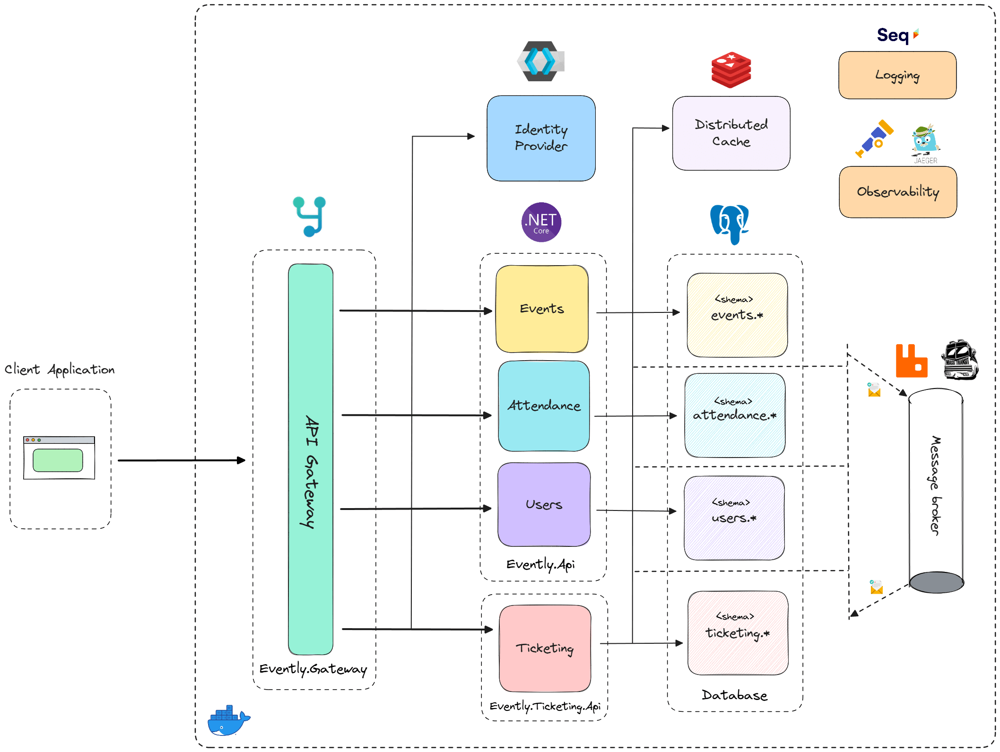
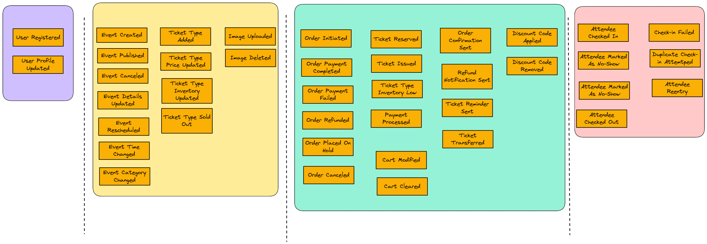
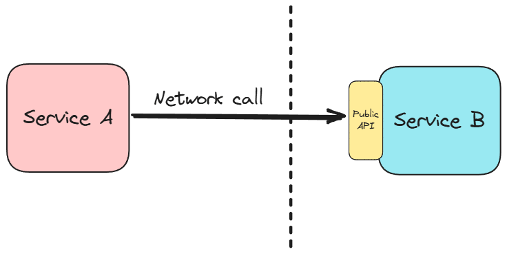
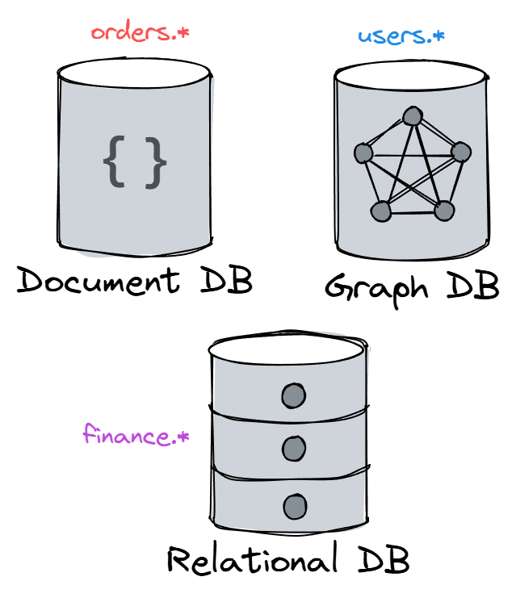
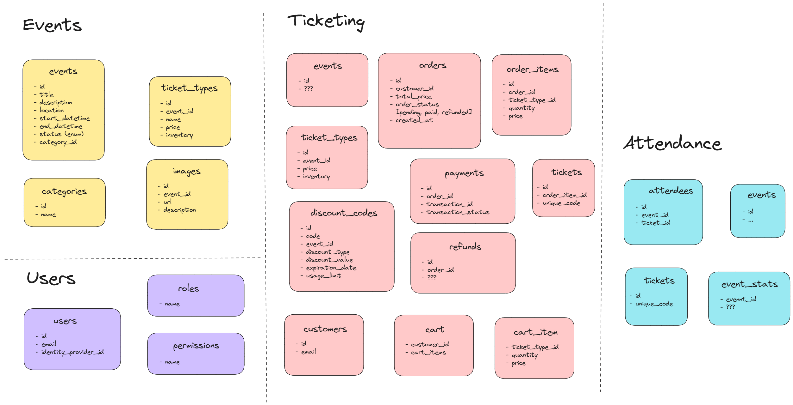

- **Citação**
  - **Título**: Understanding Microservices: Core Concepts and Benefits
  - **Autor**: Milan Jovanović
  - **Fonte**: Milan Jovanović's Blog
  - **URL**: https://www.milanjovanovic.tech/blog/understanding-microservices-core-concepts-and-benefits?utm_source=newsletter&utm_medium=email&utm_campaign=tnw138
  - **Atualizado**: 19 de abril de 2025

---

# Compreendendo os microsserviços: principais conceitos e benefícios

Tenho revisitado o excelente livro de Sam Newman ["Monolith to Microservices"](https://www.oreilly.com/library/view/monolith-to-microservices/9781492047834/) recentemente, e ele me lembrou o quão transformadora essa abordagem arquitetônica pode ser **quando aplicada corretamente**.

Como alguém que implementou microsserviços em várias organizações, gostaria de compartilhar alguns insights valiosos que adquiri por meio de estudos e experiência prática.

O que exatamente são microsserviços e por que eles podem ser a escolha arquitetônica certa para sua organização?

Vamos nos aprofundar nos principais conceitos e benefícios da arquitetura de microsserviços.

## [O que são microsserviços?](#o-que-são-microsserviços)

Microsserviços são serviços **implantáveis de forma independente** modelados em torno de um **domínio de negócios**. O domínio de negócios é fundamental aqui, mas falaremos mais sobre isso depois. Eles se comunicam entre si por meio de redes e oferecem diversas opções para resolver problemas arquitetônicos complexos.

Pense nos microsserviços como equipes pequenas e focadas, em vez de um grande departamento. Cada equipe tem uma responsabilidade específica, opera de forma relativamente independente e se comunica claramente com outras equipes quando necessário. Em vez de uma base de código enorme que cuida de tudo, você tem várias bases de código menores, cada uma focada em uma capacidade de negócios específica.

Como Sam Newman os define em "Monolith to Microservices":

> Microsserviços são serviços implantáveis de forma independente, modelados em torno de um domínio de negócios. Eles se comunicam entre si por meio de redes e, como opção de arquitetura, oferecem muitas opções para resolver os problemas que você possa enfrentar.

Microsserviços oferecem uma estratégia para projetar um sistema modular e decompô-lo em contextos delimitados. No entanto, o problema que vejo com frequência é que os desenvolvedores usam microsserviços para impor limites de código. Isso é um erro. Corrigiremos isso em breve.

## [Principais características dos microsserviços](#caracteristicas-chave-dos-microserviços)

Vamos explorar algumas das principais características que definem os microsserviços:

### [Implantabilidade Independente](#independent-deployability)

Você pode fazer alterações em um microsserviço e implantá-lo em produção sem precisar implantar mais nada. Isso não é apenas uma habilidade teórica — é uma disciplina que você pratica na maioria dos seus lançamentos.

O valor aqui é significativo: **implantações menores** acarretam **menos riscos**, permitem **ciclos de lançamento mais rápidos** e permitem que as equipes testem suas alterações isoladamente.

Quando um bug crítico aparece em um serviço, você pode corrigir e implantar apenas esse serviço, em vez de orquestrar uma versão completa do sistema. Isso é especialmente valioso em sistemas grandes, onde coordenar versões pode ser um pesadelo logístico.

### [Foco no Domínio de Negócios](#business-domain-focus)

Os microsserviços são organizados em torno de [**recursos de negócios**](https://www.milanjovanovic.tech/blog/screaming-architecture) em vez de camadas técnicas. Em vez de ter equipes separadas de front-end, back-end e banco de dados (e a coordenação necessária), você pode ter equipes dedicadas a "Gerenciamento de Eventos", "Contas de Clientes" ou "Atendimento".

Esse alinhamento facilita a implementação de mudanças nas funcionalidades de negócios, já que todo o código relacionado – da interface do usuário ao armazenamento de dados – é agrupado. Quando um requisito de negócios muda, muitas vezes é possível alterar apenas um serviço, em vez de coordenar as mudanças em várias camadas.

### [Propriedade dos Dados](#propriedade-dos-dados)

Microsserviços **encapsulam o armazenamento** e a recuperação de dados, expondo os dados apenas por meio de [**interfaces bem definidas**] ([APIs internas vs. públicas em monólitos modulares](https://www.milanjovanovic.tech/blog/internal-vs-public-apis-in-modular-monoliths)). Os bancos de dados ficam ocultos dentro dos limites do serviço, em vez de serem compartilhados entre os serviços.

Isso contrasta fortemente com as abordagens tradicionais, nas quais vários aplicativos compartilham um banco de dados comum, o que muitas vezes leva a um acoplamento rígido e a alterações de esquema arriscadas.

Quando um serviço possui seus dados exclusivamente, ele pode:

- Evoluir seu modelo de dados interno sem quebrar outros serviços
- Implementar a tecnologia de armazenamento mais adequada às suas necessidades
- Fornecer uma API estável para que outros serviços acessem seus dados.

Não é incomum que vários serviços compartilhem o mesmo banco de dados, mas, ao fazer isso, você estará abrindo mão de alguns dos benefícios dos microsserviços. Na prática, um banco de dados por serviço é a abordagem mais comum.

### [Comunicação de rede](#network-communication)

Os serviços se comunicam entre si por meio de redes, tornando os microsserviços uma forma de sistema distribuído. Essa comunicação baseada em rede pode usar [**APIs REST**](https://www.milanjovanovic.tech/pragmatic-rest-apis), filas de mensagens, gRPC, GraphQL ou outros protocolos, dependendo das necessidades específicas.

Essa comunicação explícita por meio de redes permite que os serviços sejam implantados de forma independente e até mesmo executados em infraestruturas diferentes. Mas também significa lidar com latência de rede, possíveis falhas e problemas de serialização.

As equipes que criam microsserviços precisam projetar cuidadosamente seus [**padrões de comunicação entre serviços**](https://www.milanjovanovic.tech/blog/modular-monolith-communication-patterns) para equilibrar desempenho, confiabilidade e flexibilidade.

## [As origens dos microsserviços](#as-origens-dos-microsserviços)

O termo "microsserviços" tem uma história de origem interessante. Em 2011, um consultor de software chamado James Lewis se interessou pelo que chamou de "microaplicativos" — pequenos serviços otimizados para serem facilmente substituíveis.

A característica distintiva era o escopo reduzido desses serviços. Alguns podiam ser escritos ou reescritos em poucos dias. À medida que as discussões evoluíam, o termo "microsserviços" foi adotado, visto que não se tratava de aplicativos independentes, mas sim de serviços que funcionavam em conjunto.

Vale ressaltar que, embora "micro" esteja no nome, o tamanho de um microsserviço não é sua característica definidora. Trata-se, sim, de ter serviços com limites bem definidos que podem ser desenvolvidos, implantados e escalonados de forma independente.

## [Principais benefícios dos microsserviços](#key-benefits-of-microservices)

Quais são os benefícios de adotar uma arquitetura de microsserviços?

Por que você deveria considerar isso para sua organização?

Vamos explorar algumas das principais vantagens:

### [Flexibilidade e Adaptabilidade](#flexibility-and-adaptability)

**Os microsserviços oferecem opções**. Eles oferecem flexibilidade em como você pode escalar, evoluir e manter seu sistema ao longo do tempo.

- Quando os requisitos de negócios mudam, você pode modificar apenas os serviços afetados em vez de arriscar alterações em todo o sistema.
- Novos recursos podem ser introduzidos como novos serviços sem interromper a funcionalidade existente.
- À medida que sua compreensão do domínio aumenta, os limites do serviço podem evoluir para refletir melhor essa compreensão.

Essa capacidade de evoluir gradualmente é particularmente valiosa em ambientes de negócios que mudam rapidamente, onde o tempo de lançamento no mercado é crítico.

### [Diversidade Tecnológica](#diversidade-tecnológica)

Com microsserviços, você pode misturar e combinar pilhas de tecnologia. Cada serviço pode usar a linguagem de programação, banco de dados ou framework mais adequado às suas necessidades específicas. Essa prática é conhecida como programação poliglota e [**persistência poliglota**](https://www.milanjovanovic.tech/blog/modular-monolith-data-isolation).

Por exemplo, um mecanismo de recomendação pode usar Python com bibliotecas especializadas em aprendizado de máquina. Por outro lado, um serviço de processamento de transações pode usar .NET por suas fortes características de tipagem e desempenho.

Um serviço de relatórios pode usar um banco de dados em colunas otimizado para análise, enquanto um serviço de perfil de usuário pode usar um banco de dados de documentos que se ajuste melhor ao seu modelo de dados.

Essa flexibilidade permite que as equipes escolham a ferramenta certa para cada trabalho, em vez de comprometer uma abordagem única para todos.

### [Desenvolvimento Paralelo](#parallel-development)

Várias equipes podem trabalhar em diferentes serviços simultaneamente sem atrapalhar umas às outras. Essa paralelização pode acelerar significativamente a velocidade de desenvolvimento em organizações maiores.

Cada equipe pode manter seu próprio cronograma de lançamentos, tomar decisões tecnológicas e otimizar para as necessidades específicas de seus serviços sem precisar coordenar com todas as outras equipes. Vi em primeira mão como essa autonomia pode reduzir as dependências entre as equipes, minimizando gargalos e tempos de espera.

As organizações geralmente estruturam suas equipes em torno de serviços ou grupos de serviços relacionados. Você pode conhecer este conceito como [Lei de Conway](https://en.wikipedia.org/wiki/Conway%27s_law):

> As organizações que projetam sistemas são obrigadas a produzir projetos que sejam cópias das estruturas de comunicação dessas organizações.

### [Escalonamento direcionado](#targeted-scaling)

Você pode dimensionar apenas os serviços que precisam, em vez de dimensionar o sistema inteiro. Isso proporciona uma utilização mais eficiente dos recursos e pode reduzir os custos operacionais.

Por exemplo, se seu catálogo de produtos precisa lidar com alto tráfego durante uma venda, você pode dimensionar apenas o serviço de catálogo sem dimensionar seu serviço de processamento de pagamentos.

Esse escalonamento granular torna-se especialmente valioso à medida que os sistemas crescem e diferentes componentes têm características de desempenho distintas. Alguns serviços podem exigir muita CPU, enquanto outros exigem muita memória. Com microsserviços, você pode otimizar a infraestrutura para as necessidades específicas de cada serviço.

Essa abordagem pode levar a economias de custos significativas em comparação ao [**dimensionamento de um monólito**](https://www.milanjovanovic.tech/blog/scaling-monoliths-a-practical-guide-for-growing-systems), em que todos os componentes devem ser dimensionados juntos, independentemente de seus requisitos individuais.

### [Alinhamento Organizacional](#alinhamento-organizacional)

Os microsserviços podem ajudar a alinhar sua arquitetura técnica com a estrutura organizacional. As equipes podem ter serviços específicos que correspondem à sua expertise no domínio de negócios, promovendo maior clareza de propriedade e responsabilidade.

Esse alinhamento reduz transferências de responsabilidade e custos de coordenação entre as equipes, pois cada equipe tem limites claros de responsabilidade. Isso reforça a Lei de Conway de forma positiva. Em vez de deixar que sua estrutura de comunicação crie sua arquitetura acidentalmente, você projeta deliberadamente suas equipes e seus serviços em torno das capacidades do negócio.

Essa abordagem pode levar a estruturas de equipe e limites de software mais estáveis ao longo do tempo, já que os domínios de negócios tendem a evoluir mais lentamente do que as implementações técnicas.

## [Desafios a Considerar com Microsserviços](#challenges-to-consider-with-microservices)

Embora os microsserviços ofereçam inúmeros benefícios, eles apresentam desafios:

### [Complexidade do Sistema Distribuído](#distributed-system-complexity)

A comunicação em rede introduz latência, desafios de confiabilidade e dificulta a depuração. Os serviços devem lidar com falhas de rede com elegância, implementar novas tentativas com estratégias de recuo e lidar com a realidade de que uma solicitação pode ser bem-sucedida, mas a resposta pode ser perdida.

[**Rastreamento distribuído**](https://www.milanjovanovic.tech/blog/introduction-to-distributed-tracing-with-opentelemetry-in-dotnet) se torna essencial para entender como as solicitações fluem pelo sistema.

Você precisará desenvolver estratégias para lidar com falhas parciais do sistema. Conceitos como disjuntores e anteparas passam a fazer parte do seu vocabulário cotidiano.

### [Sobrecarga Operacional](#sobrecarga-operacional)

Gerenciar muitos serviços requer [**pipelines de implantação**](https://www.milanjovanovic.tech/blog/streamlining-dotnet-9-deployment-with-github-actions-and-azure) robustos, ferramentas de monitoramento e depuração. Você precisará investir em automação para implantação, [**verificação de integridade**](https://www.milanjovanovic.tech/blog/health-checks-in-asp-net-core), escalonamento e talvez [**descoberta de serviços**](https://www.milanjovanovic.tech/blog/how-dotnet-aspire-simplifies-service-discovery). Cada serviço precisa de monitoramento, registro em log e alertas.

Essa sobrecarga pode ser substancial. Organizações que executam microsserviços com sucesso geralmente contam com uma forte cultura de DevOps e ferramentas para gerenciar essa complexidade.

### [Consistência de dados](#consistência-de-dados)

Manter a consistência entre os limites de serviço se torna mais desafiador sem a segurança das [**transações de banco de dados**](https://www.milanjovanovic.tech/blog/working-with-transactions-in-ef-core).

A implementação de processos de negócios que abrangem vários serviços frequentemente requer modelos de consistência eventual e mecanismos de compensação para lidar com falhas. Você precisará projetar seus serviços com [**idempotência**](https://www.milanjovanovic.tech/blog/implementing-idempotent-rest-apis-in-aspnetcore) em mente e pode precisar implementar padrões como o [**padrão Saga**](https://www.milanjovanovic.tech/blog/implementing-the-saga-pattern-with-masstransit) para gerenciar transações distribuídas.

Essas abordagens aumentam a complexidade, mas podem levar a sistemas mais resilientes quando implementadas corretamente.

### [Coordenação de Serviços](#service-coordination)

Orquestrar fluxos de trabalho que abrangem múltiplos serviços exige um design cuidadoso. Processos simples em um monólito podem se tornar coreografias complexas em uma arquitetura de microsserviços.

Você precisará decidir se usará [**orquestração**](https://www.milanjovanovic.tech/blog/orchestration-vs-choreography) (onde um serviço central direciona o processo) ou [**coreografia**](https://www.milanjovanovic.tech/blog/orchestration-vs-choreography) (onde os serviços reagem a eventos sem coordenação central). Esses padrões têm diferentes compensações em termos de acoplamento, resiliência e observabilidade.

Projetar esses fluxos de trabalho entre serviços geralmente revela limites de subdomínios que você pode ter perdido na modelagem inicial .

## [Principal lição](#principal-lição)

Na minha experiência, o mais importante a lembrar é que os microsserviços, em última análise, **compram opções**. Eles oferecem flexibilidade, mas têm custos.

Esses custos valem as opções que você deseja exercer?

Para organizações com uma grande equipe de engenharia trabalhando em um sistema complexo que precisa evoluir rapidamente, os microsserviços podem valer a pena. Para equipes menores ou sistemas com requisitos mais estáveis, um [**monólito bem projetado**](https://www.milanjovanovic.tech/blog/what-is-a-modular-monolith) pode ser mais apropriado. Esqueça o desenvolvimento orientado a currículos por um momento. O importante é resolver seus problemas específicos com **compensações aceitáveis**.

No meu trabalho, descobri que as adoções de microsserviços mais bem-sucedidas começam aos poucos, muitas vezes com a separação de apenas um ou dois serviços de um único serviço. Depois, expandem gradualmente à medida que a organização desenvolve as habilidades e a infraestrutura necessárias. Essa abordagem evolutiva reduz os riscos e permite que as equipes aprendam à medida que avançam.

Gosto sempre de refletir sobre estas questões:

1. Quais partes da arquitetura atual se beneficiariam mais da implantação independente ?
2. Quais desafios a organização pode enfrentar ao adotar microsserviços?
3. Até que ponto o sistema atual está alinhado com os domínios de negócios?

Se você quiser se aprofundar na construção de microsserviços, mas partindo de um monólito, confira [**Arquitetura de Monólito Modular**](https://www.milanjovanovic.tech/modular-monolith-architecture). Há um capítulo inteiro dedicado ao desenvolvimento de microsserviços, incluindo técnicas avançadas como gateways de API, uso de filas de mensagens e testes de integração de sistemas.

Obrigado pela leitura.

E continue incrível!

---
