- **Citação**
  - **Título**: Why C#?
  - **Autor**: Dr Milan Milanović
  - **Fonte**: Tech World With Milan Newsletter
  - **URL**: https://newsletter.techworld-with-milan.com/p/why-csharp
  - **Atualizado**: 24 de abril de 2025

---

# Por que C#?

24 de abril de 2025

Eu poderia ter ficado cético se alguém me dissesse anos atrás que **[C#](<https://en.wikipedia.org/wiki/C_Sharp_(programming_language)>)** se tornaria minha linguagem de programação preferida para a maioria dos projetos. Como muitos desenvolvedores, explorei várias linguagens ao longo da minha carreira — desde C++ de baixo nível até Java, a rainha das empresas. Mesmo assim, continuo voltando para C#, e muitas pessoas me perguntam por quê.

[C#](<https://en.wikipedia.org/wiki/C_Sharp_(programming_language)>) foi a resposta da Microsoft ao Java durante a guerra de plataformas do início dos anos 2000, mas rapidamente se tornou algo que o Java nunca conseguiu. Foi projetada como uma linguagem fortemente tipada que combinava a robustez do C++ com a simplicidade do Visual Basic.

Ao contrário de algumas linguagens que lutam para evoluir, o C# tem sido continuamente refinado, adaptando-se aos paradigmas de programação modernos, mas mantém a compatibilidade com versões anteriores.

Algumas pessoas costumam me perguntar por que escolhi C# em vez de muitas outras linguagens, e neste texto tentarei explicar o porquê.


Discutiremos o seguinte:

1. **O que é C#?** Uma visão geral das origens, objetivos, principais características e filosofia de design do C#.
2. **A linguagem**. Discutiremos recursos essenciais do C#, incluindo programação orientada a objetos, sistema de tipos, genéricos, lambdas, LINQ, async/await e gerenciamento de memória.
3. **O ecossistema .NET.** Exploraremos o ecossistema em que o C# se encontra, seus diferentes tempos de execução e as estruturas que permitem que ele atenda a diversos domínios de aplicação.
4. **Ferramentas**. Analisaremos ferramentas de desenvolvimento e IDEs populares, como Visual Studio, Visual Studio Code, JetBrains Rider e .NET CLI.
5. **Bibliotecas**. Exploraremos as bibliotecas padrão do .NET e os pacotes populares de terceiros disponíveis via NuGet.
6. **Documentação**. Quais são alguns recursos disponíveis e populares, documentação oficial e materiais recomendados para aprender C# e .NET?
7. **Comunidade**. Responderemos às perguntas sobre que tipo de comunidade o C# possui e quais são as iniciativas, recursos e plataformas essenciais que dão suporte aos desenvolvedores.
8. **O concurso de popularidade**. Verificaremos a popularidade do C#, suas classificações, relevância para o mercado de trabalho, salários e percepção da comunidade.
9. **C# vs. outras linguagens**. Como C# se compara a Java, Python, F# e JavaScript/TypeScript.
10. **O futuro do C#.** Qual é a evolução futura do C#, os avanços recentes da linguagem e a visão da Microsoft para inovação contínua.
11. **Conclusão**. Minhas ideias sobre por que C# é uma boa escolha e adequada para diversos cenários de desenvolvimento.
12. **Bônus: Uma breve história do C#**. Uma linha do tempo histórica destacando marcos significativos na evolução da linguagem C#.

Então, vamos começar.

## 1. O que é C#?

C# (pronuncia-se "C-sharp") é uma linguagem de programação moderna e multiparadigma desenvolvida pela Microsoft. Criada por Anders Hejlsberg e sua equipe como parte da iniciativa .NET (ele lidera o TypeScript atualmente), C# foi projetada desde o início para ser orientada a objetos, orientada a componentes e com tipagem segura.

> 💡 _O próprio nome tem uma origem interessante **— é uma referência musical.** O símbolo '#' indica que um semitom deve elevar uma nota na notação musical. Portanto, "C#" sugere que a linguagem é um **"incremento" em relação a C/C++**. O símbolo # também se assemelha habilmente a quatro sinais "+" empilhados, sugerindo que C# é "C++++"._

[](https://substackcdn.com/image/fetch/f_auto,q_auto:good,fl_progressive:steep/https%3A%2F%2Fsubstack-post-media.s3.amazonaws.com%2Fpublic%2Fimages%2Ff7a78b20-7f53-45bc-b292-eebf154772ef_3938x2475.svg)

Quando o C# foi lançado, um programa simples do tipo "Hello World" exigia várias linhas de código com namespaces, classes e declarações de métodos. Mas, à medida que a linguagem evoluiu, ela se tornou mais simples. Com as instruções de nível superior do C# 9, o programa C# mais simples agora pode ser escrito como:

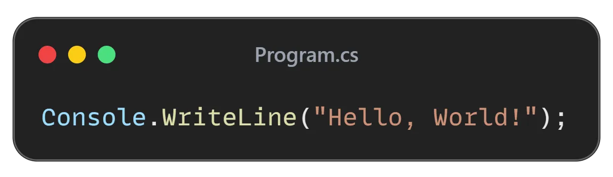

Não é ótimo? Uma linguagem multiplataforma super-rica pode ter um programa de uma linha.

Em sua essência, C# é:

- **Moderno**: Atualizado continuamente com novos recursos que refletem o cenário de programação em evolução
- **Maduro**: Tem 25 anos e evoluiu significativamente, mas ainda está ativo em desenvolvimento.
- **Tipo seguro**: Evita erros de tipo por meio de seu sistema de tipos forte.
- **Multiparadigma**: É uma linguagem fortemente orientada a objetos, que inclui estilos de programação imperativos, declarativos e funcionais.
- **Orientado a componentes**: Suporta o desenvolvimento de componentes autocontidos e reutilizáveis.
- **Multiplataforma**: embora inicialmente reservado para Windows, agora pode ser executado em Linux, Mac e outras plataformas.
- **Versátil**: Adequado para desenvolver uma ampla gama de aplicativos, da web ao celular e ao desktop
- **Código aberto:** desde a versão 7, o C# tem sido totalmente desenvolvido abertamente no GitHub, e a Microsoft aceita comentários e propostas da comunidade na **[página oficial do C# no GitHub](https://github.com/dotnet/csharplang)**.
- **Legível:** C# reconhece que os desenvolvedores passam mais tempo lendo código do que escrevendo. A linguagem foi projetada desde o início com a legibilidade em mente, facilitando a colaboração das equipes e a manutenção de bases de código ao longo do tempo.

O compilador C# gera código de **Linguagem Intermediária (IL)** que é executado no **Common Language Runtime (CLR)**, que faz parte do **tempo de execução do .NET** (também compartilhado com outras linguagens, como F# e Visual Basic).

Essa abordagem oferece benefícios como gerenciamento automático de memória, segurança de tipo e acesso a uma biblioteca padrão abrangente.

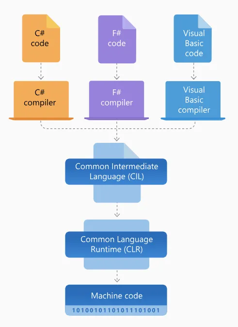

Arquitetura do .NET Framework (Fonte: [Microsoft](https://dotnet.microsoft.com/en-us/learn/dotnet/what-is-dotnet-framework))

## 2. A Linguagem

O que me atraiu inicialmente para C# não foi sua sintaxe (que era familiar aos desenvolvedores Java e C++), mas suas boas escolhas de design. Ao longo dos anos, C# deixou de ser uma linguagem simples orientada a objetos e se tornou uma linguagem muito mais rica.

Esta linguagem utiliza múltiplos paradigmas de programação com o mesmo núcleo da primeira versão.

Vamos dar uma olhada no básico:

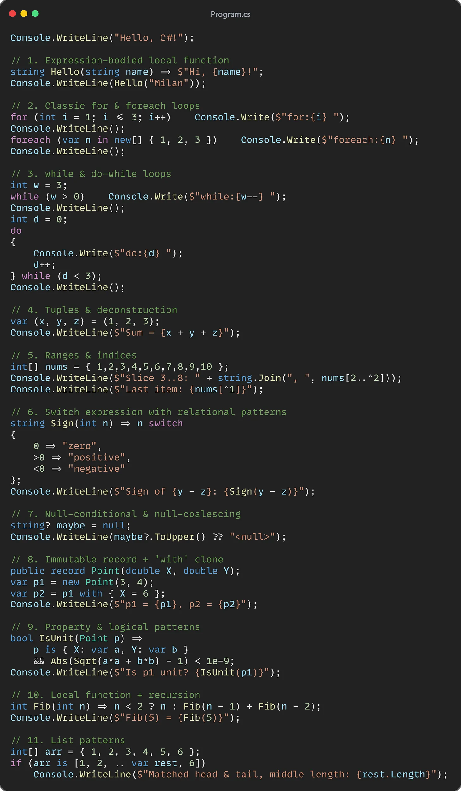

Fácil de entender, incluindo até mesmo alguns recursos de linguagem moderna.

Mas vamos dar uma olhada em algo mais interessante:

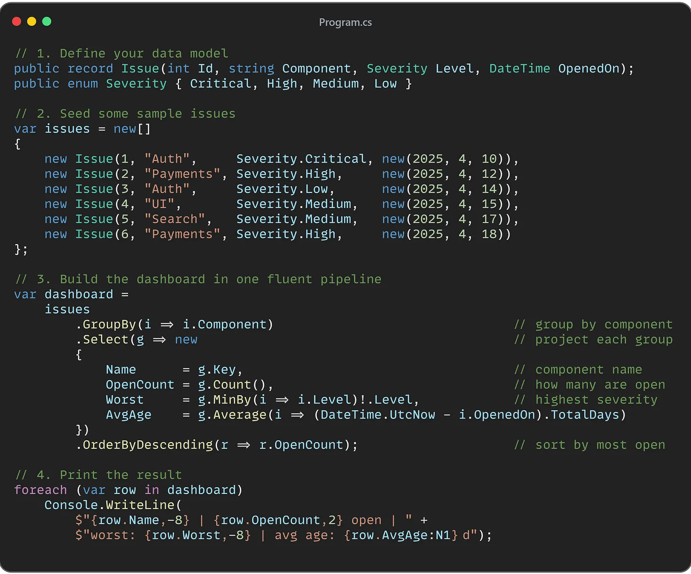

Este único arquivo mostra como o C# moderno equilibra brevidade com clareza (usando LINQ, que descreveremos em breve). Fenomenal!

Um aspecto notável do C# é a sua capacidade de **encapsular a complexidade**. Você pode usar com sucesso recursos avançados como iteradores, async/await ou LINQ sem entender completamente os detalhes internos de sua implementação.

Isso aplica o **princípio de encapsulamento orientado a objetos à linguagem**, permitindo que os desenvolvedores usem recursos modernos de forma produtiva, sem conhecer todos os detalhes da implementação.

> 👉 _Confira minha **[folha de dicas de C#](https://github.com/milanm/csharp-cheatsheet)** completa se quiser uma referência rápida de sintaxe. Eu a criei como um complemento para esta edição do boletim informativo._
>
> [](https://github.com/milanm/csharp-cheatsheet)

Então, vamos dar uma olhada nas características mais importantes do C#:

### Fundamentos orientados a objetos

Em sua essência, **C# é uma linguagem de programação orientada a objetos** construída em torno dos princípios de **encapsulamento, herança e polimorfismo** desde o primeiro dia.

Você define **[classes](https://learn.microsoft.com/en-us/dotnet/csharp/fundamentals/types/classes)** para modelar entidades do mundo real ou conceitos abstratos, agrupando estado (campos/propriedades) e comportamento (métodos). Você cria **objetos (instâncias)** dessas classes para usar em tempo de execução.

C# também oferece suporte a **[interfaces](https://learn.microsoft.com/en-us/dotnet/csharp/fundamentals/types/interfaces)** (contratos abstratos que classes podem implementar) e **classes abstratas** (classes base que fornecem alguma implementação, mas não são instanciáveis).

Por exemplo, considere uma hierarquia de classes simples:

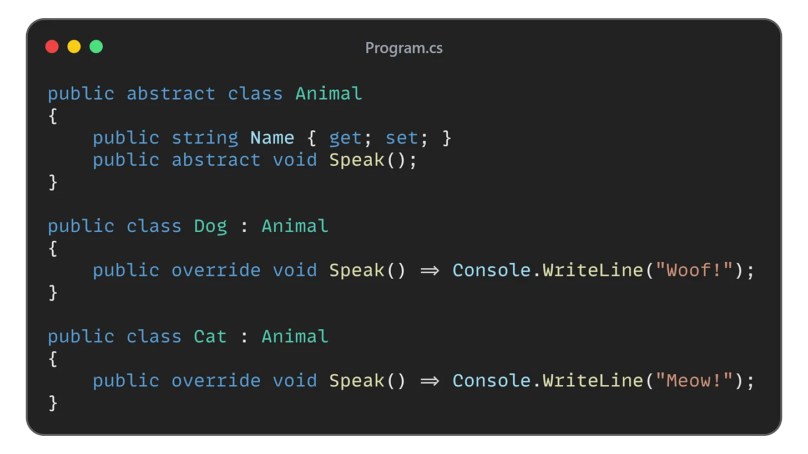

Aqui, `Animal`. A classe base abstrata define um conceito geral de um animal com um Nome e um comportamento de Fala, mas o som real é deixado abstrato. `Cachorro` e `Gato` herdam de `Animal` e fornecem implementações concretas de `Speak()`.

Isso demonstra:

- **Herança** (Cachorro _é_ um Animal)
- **Polimorfismo** (um método se comporta de maneira diferente dependendo do tipo derivado real) e
- **Encapsulamento** (cada classe encapsula seus detalhes de implementação – por exemplo, as especificações de `Speak()`).

Em um programa C#, pode-se escrever:

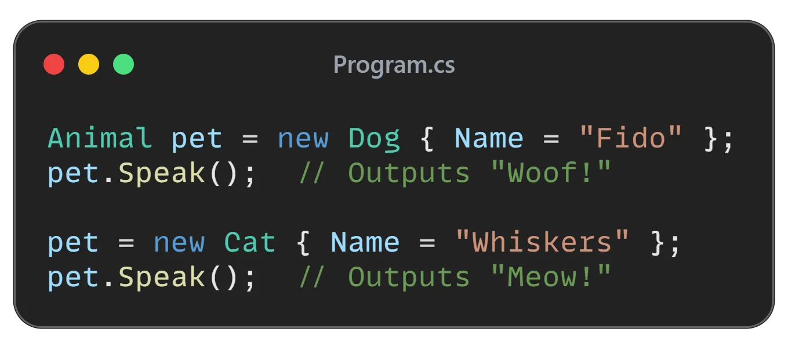

Devido ao polimorfismo, a chamada para `pet.Speak()` invoca a substituição correta com base no tipo de tempo de execução (Cachorro ou Gato).

C# torna esse tipo de código orientado a objetos fácil e seguro em termos de tipos.

### Sistema de tipos

O sistema de tipos do C# evoluiu de um sistema de tipos estáticos relativamente simples para algo muito mais sofisticado, com genéricos, tipos anuláveis, correspondência de padrões e registros.

A introdução de **[tipos de referência anuláveis](https://learn.microsoft.com/en-us/dotnet/csharp/nullable-references) no C# 8.0** foi crítica porque nos ajudou a evitar um dos erros de tempo de execução mais comuns na programação orientada a objetos: a famosa `NullReferenceException`.

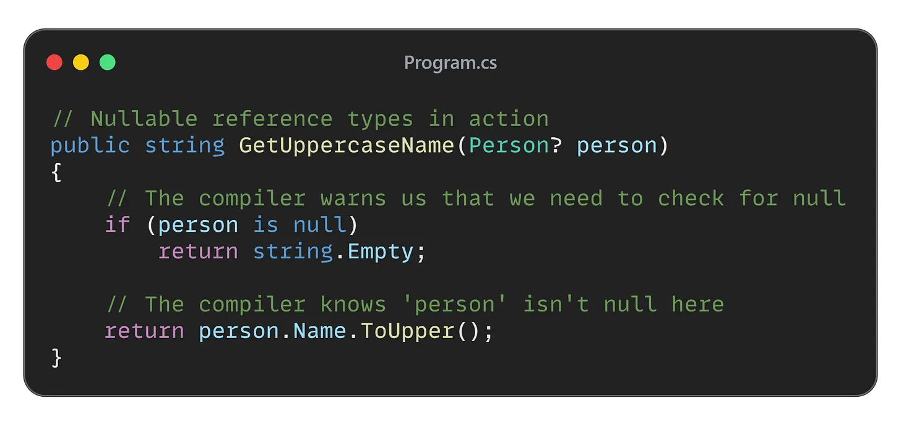

O [sistema de tipos](https://learn.microsoft.com/en-us/dotnet/standard/base-types/common-type-system) do C# ajuda a detectar erros em tempo de compilação, ao mesmo tempo que nos permite escrever código expressivo.

### Genéricos

Uma das primeiras adições significativas ao C# foram os **[genéricos](https://learn.microsoft.com/en-us/dotnet/csharp/fundamentals/types/generics)** (adicionados no C# 2.0). Os genéricos permitem definir classes e métodos com espaços reservados para tipos, permitindo um código mais reutilizável e com tipagem mais segura.

Por exemplo, se você quiser uma lista de itens, pode usar a classe interna `List<T>` – onde `T` pode ser qualquer tipo. Isso significa que você não precisa criar classes separadas como `IntList`, `StringList`, etc., e você obtém verificação de tipo em tempo de compilação para qualquer tipo que usar.

Aqui está uma demonstração simples de uma classe e método genéricos:

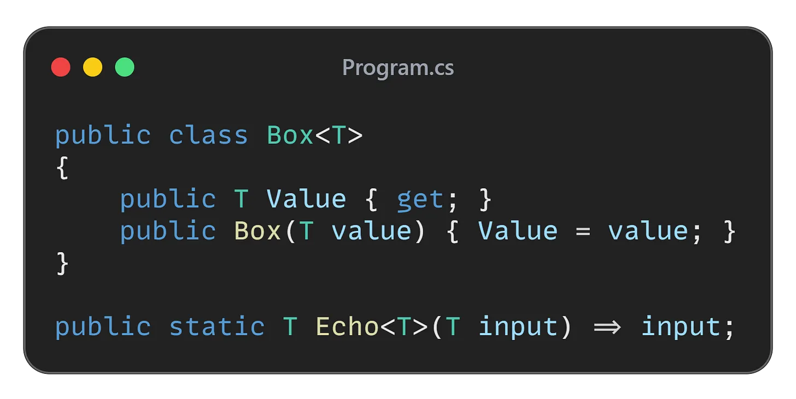

Definimos uma classe genérica `Box<T>` que pode conter um `Value` de qualquer tipo `T`. Também temos um método genérico, `Echo<T>`, que simplesmente retorna o valor de entrada (de qualquer tipo).

Podemos usar esses genéricos assim:

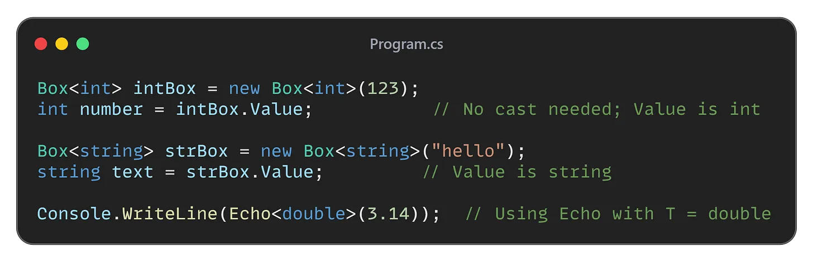

Genéricos permitem **polimorfismo paramétrico** – nosso código funciona com qualquer tipo, mas permanece **seguro em relação a tipos**. O compilador garante que você coloque apenas um `int` em um `Box<int>`, uma `string` em `Box<string>` e assim por diante. Não há conversão em tempo de execução ao recuperar `Value`; ele já é o tipo correto, evitando exceções de conversão de classe que eram comuns antes dos genéricos.

### Expressões lambda

Por volta de 2007, o C# começou a incorporar mais conceitos de programação funcional para complementar seu lado orientado a objetos (influência do [F#](https://fsharp.org/)).

A introdução de **[expressões lambda](https://learn.microsoft.com/en-us/dotnet/csharp/language-reference/operators/lambda-expressions)** no C# 3.0 foi um momento crítico. Uma expressão lambda é uma **função anônima** – uma parte do código que você pode tratar como dados: passá-la adiante, armazená-la em uma variável, chamá-la posteriormente, etc. Lambdas trazem um pouco de "açúcar sintático" funcional que torna tarefas específicas muito mais concisas e expressivas.

Para entender a importância, pense em como você realizaria uma tarefa simples: _filtrar uma lista de números para obter apenas os pares_.

Antes de lambdas (e LINQ), você pode escrever:

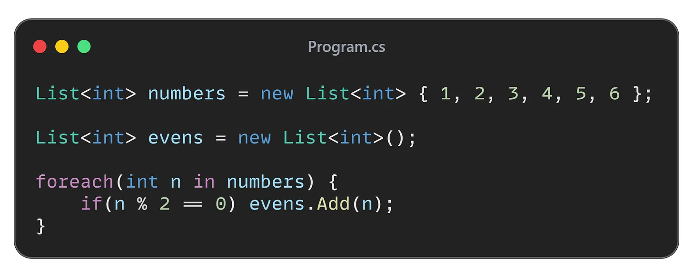

Isso funciona, mas é um pouco complexo de escrever. Com lambdas, você pode fazer:

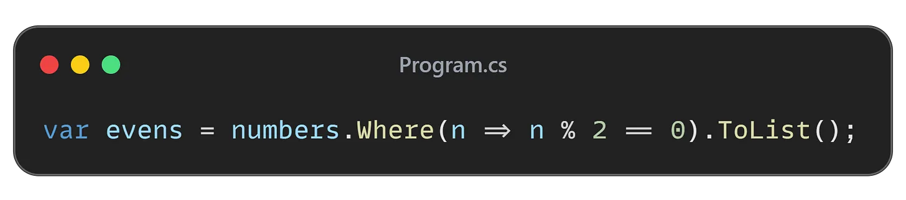

Aqui `x => x * x` define uma função anônima que eleva ao quadrado sua entrada, e a atribuímos ao delegado `square`.

Tão poderoso!

### LINQ

Talvez o recurso matador que fez muitos desenvolvedores se apaixonarem por C# seja o **[LINQ](https://learn.microsoft.com/en-us/dotnet/csharp/linq/)** (Consulta Integrada à Linguagem). Introduzido no C# 3.0, o LINQ é um conjunto de recursos de linguagem e framework que permite **consultar e manipular dados declarativamente**.

Se você já escreveu consultas SQL, o LINQ parecerá familiar, exceto pelo fato de que você pode usá-lo em todos os tipos de dados (coleções na memória, tabelas de banco de dados, documentos XML, etc.) diretamente do código C#, com verificação em tempo de compilação e IDE IntelliSense.

**Por exemplo**, _você tem uma lista de_ objetos `Livro` e quer encontrar todos os livros escritos por um autor específico, ordená-los por título e selecionar apenas os títulos. Sem LINQ, você escreveria loops aninhados ou usaria métodos de biblioteca manualmente.

Com LINQ, é simples:

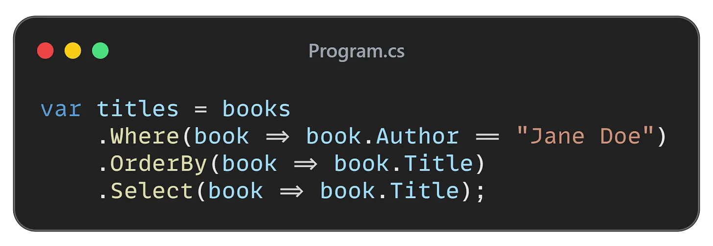

Em uma declaração fluente, filtramos (`Where`), classificamos (`OrderBy`) e projetamos (`Select`) os dados. Isso se parece muito com a própria declaração do problema.

Há também uma **sintaxe de compreensão de consulta** que se parece ainda mais com SQL:

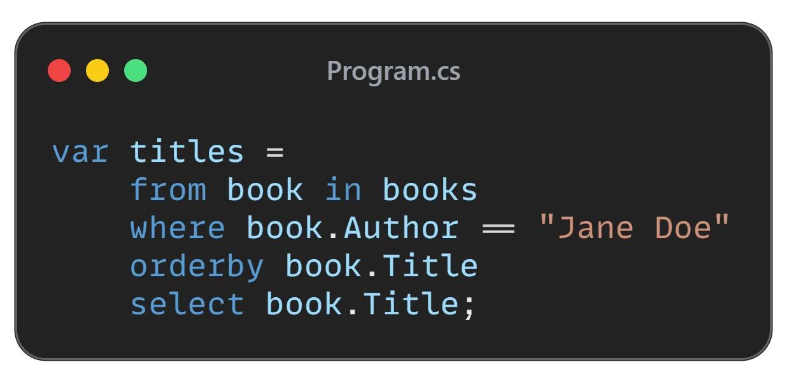

Nos bastidores, ambas as formas são equivalentes. O LINQ funciona usando métodos de extensão e lambdas (os métodos `Where`, `OrderBy` e `Select` mostrados são métodos de extensão em `IEnumerable<T>` que aceitam expressões lambda).

O compilador C# pode até mesmo traduzir a _árvore de expressões_ de uma consulta LINQ para outros formatos – por exemplo, ao consultar um banco de dados via LINQ para SQL ou Entity Framework, as expressões lambda são convertidas em uma consulta SQL enviada ao banco de dados.

Isso é poderoso: **você pode usar uma sintaxe de consulta unificada para coleções na memória, bancos de dados relacionais, XML (com LINQ para XML) e muito mais**.

Por exemplo, `employees.Where(e => e.Salary > 100000)` pode estar filtrando uma lista na memória ou pode ser traduzido para uma cláusula SQL `WHERE` para ser executada em um banco de dados – de qualquer forma, você, como programador, expressa a intenção.

> **🔍 Nos bastidores:** _LINQ funciona por meio de **execução adiada** e **iteradores**. Métodos como_ `Where` _e_ `Select` _não produzem um resultado imediatamente; eles retornam_ `IEnumerable<T>` _que, quando iterado, produzirá os resultados filtrados ou transformados imediatamente._
>
> _Isso significa que as consultas LINQ são eficientes em termos de memória (elas não necessariamente criam novas listas até que você force uma avaliação, por exemplo, chamando_ `.ToList()` _ou iterando em_ `foreach`_). Isso também significa que você pode compor consultas dinamicamente._

### Programação assíncrona

Lidar com operações assíncronas (como E/S de arquivos, chamadas de rede ou qualquer tarefa de longa duração que não devesse bloquear a thread principal) era complicado em C#. Anteriormente, precisávamos usar threads, callbacks ou eventos para gerenciar o trabalho de sincronização. Essas abordagens complexas levaram ao "**inferno dos callbacks**".

O C# resolveu isso introduzindo o padrão **[async/await](https://learn.microsoft.com/en-us/dotnet/csharp/asynchronous-programming/)** no C# 5.0, que desde então se tornou o padrão ouro para programação assíncrona em muitas linguagens.

Async/await não apenas melhora o desempenho — **ele fornece uma maneira intuitiva de implementar programação assíncrona** —, mas também mantém um nível de produtividade semelhante ao que ocorre quando escrevemos código síncrono. Esse padrão é incorporado diretamente à linguagem, facilitando a utilização de um desafio de programação tradicionalmente complexo.

Funciona da seguinte maneira: você pode marcar um método com `async` e usar a palavra-chave `await` dentro dele para pausar a execução até que uma operação assíncrona seja concluída, sem bloquear a thread. Aqui, o compilador transforma seu código em uma máquina de estados nos bastidores. Para você, parece que está escrevendo código sequencial; por baixo dos panos, é não bloqueante e eficiente.

**Exemplo:** Suponha que queremos baixar o conteúdo de uma página da web e, em seguida, contar o número de caracteres. Usando `HttpClient` do C#, que possui métodos assíncronos, ficaria assim:

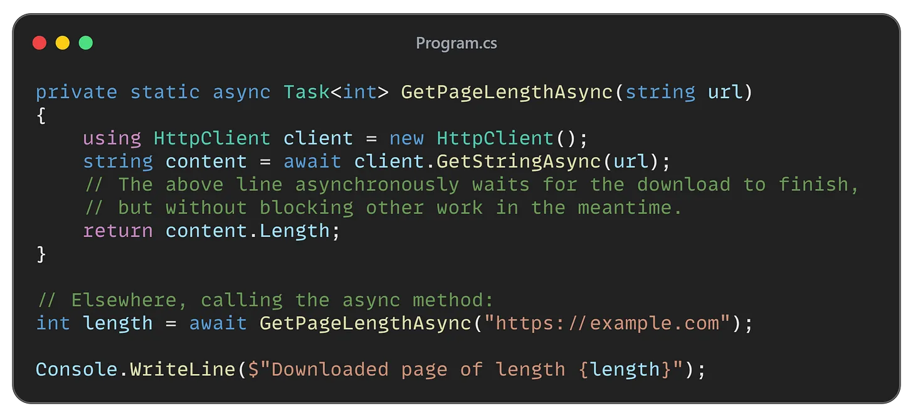

Quando `client.GetStringAsync(url)` é chamado, ele inicia uma operação de E/S. A palavra-chave `await` informa ao compilador: "após o início desta operação, retorne o controle ao chamador até que ela seja concluída e, em seguida, retome". A thread pode realizar outras tarefas (ou, se for a thread da interface do usuário, pode manter a interface do usuário responsiva). Quando o download for concluído, o restante do método (calculando `content.Length` e retornando-o) será executado, possivelmente no contexto original.

Esse estilo linear é _muito mais simples_ do que configurar um retorno de chamada ou criar manualmente um thread para fazer o download e, de alguma forma, sincronizar de volta.

Antes do async/await, o .NET tinha o **Modelo de Programação Assíncrona (APM)** `BeginOperation/EndOperation` e o Padrão Assíncrono Baseado em Eventos (EAP) – ambos eram mais complexos. O async/await unificava tudo em um modelo simples.

> **ℹ ️ Outros recursos de simultaneidade:** C# possui um modelo de programação assíncrona rico que vai além de apenas await. Há os tipos `Task` e `Task<T>` (da Biblioteca Paralela de Tarefas) que representam operações assíncronas e podem ser usados com ou sem a palavra-chave `async`.
>
> _Existem bibliotecas de fluxo de dados, fluxos assíncronos (o C# 8 adicionou_ `await foreach` _para iterar resultados de forma assíncrona, por exemplo, lendo de um fluxo de eventos) e muito mais. Mas, para a maioria dos casos, especialmente ao lidar com operações que não exigem muita CPU, async/await é a melhor opção._

### Gerenciamento de memória

Gerenciar a memória com eficiência é crucial para o desempenho e a estabilidade de qualquer aplicativo. C# simplifica esse aspecto crítico do desenvolvimento de software por meio de seu sistema de gerenciamento automático de memória, facilitado pelo coletor de lixo do **Common Language Runtime (CLR)**.

Ao contrário de linguagens como C e C++, nas quais os desenvolvedores precisam alocar e desalocar memória manualmente, C# automatiza esse processo. O coletor de lixo varre periodicamente a memória do aplicativo, identificando e recuperando o espaço ocupado por objetos que não estão mais sendo usados ou referenciados pelo programa. Esse processo automático reduz significativamente o risco de vazamentos de memória, um problema comum em ambientes de memória gerenciados manualmente.

**O coletor de lixo** utiliza um sistema geracional para maior eficiência. Todos os novos objetos começam na Geração 0. Os objetos que sobrevivem à coleta passam para a Geração 1, e os objetos persistentes eventualmente chegam à Geração 2. Essa abordagem otimiza a coleta, já que objetos mais novos tendem a ter vida útil mais curta.

Para objetos grandes (mais de 85.000 bytes), o C# usa um _Large Object Heap_ (LOH) separado que faz parte da Geração 2. Diferentemente do heap normal, o LOH não compacta a memória durante a coleta, o que pode levar à fragmentação.

Em C#, a memória é gerenciada principalmente em duas regiões: **a pilha e o heap**. A pilha armazena tipos de valor (como inteiros e booleanos) e informações de chamadas de métodos. A memória na pilha é gerenciada de forma LIFO (último a entrar, primeiro a sair) e é alocada e desalocada automaticamente quando um método é chamado e retorna. O heap, por outro lado, armazena tipos de referência (como objetos e strings).

> **📌 Observação:** _Embora o C# ofereça recursos sofisticados de gerenciamento de memória, é importante observar **que a otimização prematura raramente é necessária**. Para a maioria dos aplicativos, a legibilidade e a manutenibilidade do seu código devem ter precedência sobre o desempenho hiperotimizado._
>
> _O compilador JIT **já gera código de máquina altamente eficiente em tempo de execução**, que às vezes pode superar o código compilado antecipadamente em C e C++._
>
> _Desde o .NET 7, **[a compilação Native AOT (Ahead-Of-Time)](https://learn.microsoft.com/en-us/dotnet/core/deploying/native-aot/?tabs=windows%2Cnet8)** oferece uma opção adicional para cenários que exigem tempos de inicialização mais rápidos e menor consumo de memória, permitindo que os aplicativos sejam executados sem depender do tempo de execução do .NET._

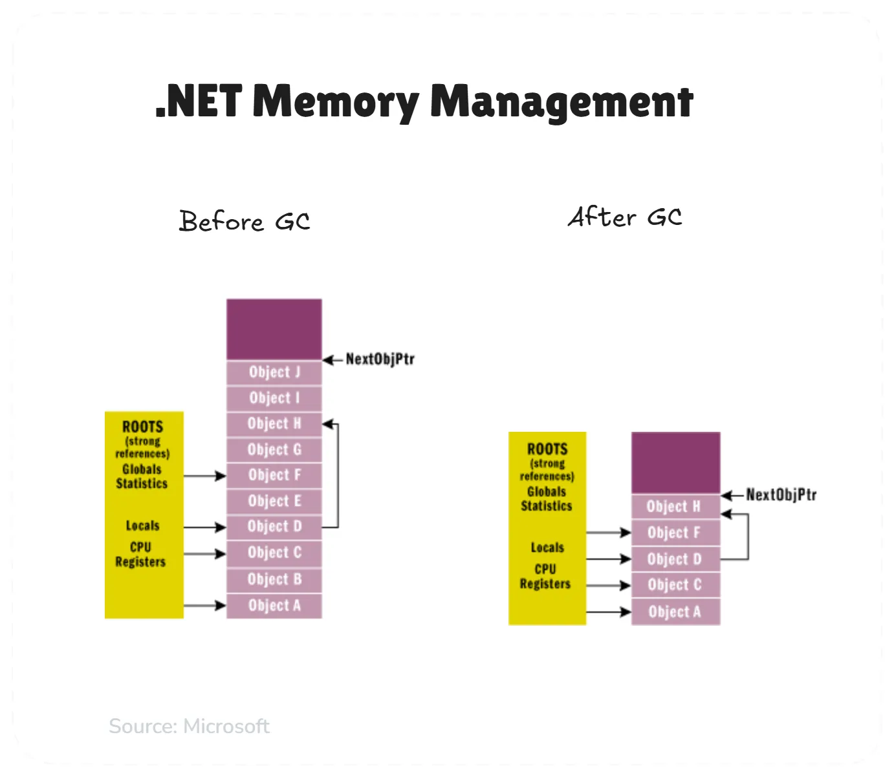

> 👉 _Um conjunto completo de recursos está documentado no **[guia da linguagem C#](https://learn.microsoft.com/en-us/dotnet/csharp/)**._

### Outros recursos importantes do C#

Além dos recursos já discutidos, C# oferece um rico conjunto de outras construções de linguagem que contribuem para seu poder e permitem a produtividade do desenvolvedor:

- ✅ **[Propriedades](https://learn.microsoft.com/en-us/dotnet/csharp/programming-guide/classes-and-structs/properties)** oferecem uma maneira limpa de acessar e alterar dados de classe. Em vez de acesso direto a campos, você escreve acessadores get e set que podem incluir lógica de validação. Isso ajuda a manter o encapsulamento adequado, ao mesmo tempo em que fornece uma sintaxe simples como `object.Property = value`. As propriedades parecem campos para os chamadores, mas podem executar código quando lidas ou modificadas.

```csharp
using System;

class Pessoa
{
    private string nome;

    public string Nome
    {
        get { return nome; }
        set
        {
            if (!string.IsNullOrWhiteSpace(value))
                nome = value;
            else
                throw new ArgumentException("O nome não pode ser vazio ou nulo.");
        }
    }
}

class Program
{
    static void Main()
    {
        Pessoa pessoa = new Pessoa();
        pessoa.Nome = "Adelino"; // Define o nome usando a propriedade
        Console.WriteLine(pessoa.Nome); // Obtém o nome usando a propriedade
    }
}
```

- Explicação rápida:

  - A classe `Pessoa` tem um campo privado `nome`.
  - A propriedade `Nome` encapsula esse campo e fornece acesso controlado a ele.
  - O método `set` garante que o valor atribuído não seja nulo ou vazio, mantendo a integridade dos dados.

- ✅ **[Registros](https://learn.microsoft.com/en-us/dotnet/csharp/language-reference/builtin-types/record)** simplificam a criação de objetos de dados imutáveis em C#. Introduzidos no C# 9, os registros usam uma sintaxe concisa como `record Person(string Name, int Age);` para definir tipos de referência com igualdade baseada em valor. Isso significa que dois registros são iguais se suas propriedades corresponderem, o que não é verdade para classes, onde a igualdade de referência é o padrão.

```csharp
using System;

record Pessoa(string Nome, int Idade);

class Program
{
    static void Main()
    {
        Pessoa pessoa1 = new("Adelino", 30);
        Pessoa pessoa2 = new("Adelino", 30);

        Console.WriteLine(pessoa1 == pessoa2); // True, pois registros com mesmos valores são iguais
        Console.WriteLine(pessoa1); // Saída automática formatada: Pessoa { Nome = Adelino, Idade = 30 }
    }
}
```

- Explicação rápida:

  - O record `Pessoa` define um tipo de referência imutável.
  - O operador `==` verifica igualdade de valores, diferente das classes que usam igualdade de referência.
  - `Console.WriteLine(pessoa1)` gera uma saída legível automaticamente, sem necessidade de sobrescrever `ToString()`.

- ✅ **[Delegates](https://learn.microsoft.com/en-us/dotnet/csharp/programming-guide/delegates/)** funcionam como referências de tipo seguro para métodos. Eles permitem armazenar métodos em variáveis, passá-los como argumentos e chamá-los posteriormente. Isso potencializa callbacks e manipuladores de eventos. Delegates nos permitem ser flexíveis em designs onde podemos trocar comportamentos em tempo de execução sem alterar a estrutura da nossa classe.

```csharp
using System;

delegate void MensagemDelegate(string mensagem);

class Program
{
    static void ExibirMensagem(string mensagem)
    {
        Console.WriteLine($"Mensagem: {mensagem}");
    }

    static void Main()
    {
        MensagemDelegate meuDelegate = ExibirMensagem; // Atribui o método ao delegate
        meuDelegate("Olá, Adelino! Delegates são incríveis!"); // Chama o método através do delegate
    }
}
```

- Explicação rápida:

  - Criamos um **delegate** chamado `MensagemDelegate`, que aceita uma `string`.
  - Definimos um método `ExibirMensagem` que imprime uma mensagem.
  - No `Main()`, associamos o método ao delegate e o chamamos.

- ✅ **[Tuplas](https://learn.microsoft.com/en-us/dotnet/csharp/language-reference/builtin-types/value-tuples)** fornecem uma maneira rápida de retornar vários valores de métodos sem criar classes personalizadas. Podemos escrever `return (sum, count);` e, no lado receptor, usar `(int total, int n) = ComputeSumAndCount(data);`.

```csharp
using System;

class Program
{
    static (int, int) CalcularSomaEContagem(int[] numeros)
    {
        int soma = 0;
        int contagem = numeros.Length;

        foreach (int num in numeros)
        {
            soma += num;
        }

        return (soma, contagem); // Retorna múltiplos valores como uma tupla
    }

    static void Main()
    {
        int[] dados = { 10, 20, 30, 40 };
        (int total, int quantidade) = CalcularSomaEContagem(dados);

        Console.WriteLine($"Soma: {total}, Contagem: {quantidade}");
    }
}
```

- Explicação rápida:

  - O método `CalcularSomaEContagem` retorna uma tupla contendo dois valores: a soma dos elementos e a quantidade de elementos no array.
  - No `Main()`, usamos **desconstrução** para atribuir os valores diretamente a variáveis `total` e `quantidade`.

- ✅ **[Correspondência de padrões](https://learn.microsoft.com/en-us/dotnet/csharp/fundamentals/functional/pattern-matching)** pode melhorar o fluxo de controle testando se os valores correspondem a padrões específicos durante a extração de dados. Em vez de complexas cadeias if-else ou verificações de tipo, você escreve expressões como `if (shape is Circle c)` para verificar o tipo e obter o objeto em uma única etapa.

```csharp
using System;

abstract class Forma {}

class Circulo : Forma
{
    public double Raio { get; }
    public Circulo(double raio) => Raio = raio;
}

class Retangulo : Forma
{
    public double Largura { get; }
    public double Altura { get; }
    public Retangulo(double largura, double altura) => (Largura, Altura) = (largura, altura);
}

class Program
{
    static void DescreverForma(Forma forma)
    {
        switch (forma)
        {
            case Circulo c:
                Console.WriteLine($"É um círculo com raio {c.Raio}.");
                break;
            case Retangulo r:
                Console.WriteLine($"É um retângulo de {r.Largura} x {r.Altura}.");
                break;
            case null:
                Console.WriteLine("Forma inválida.");
                break;
            default:
                Console.WriteLine("Forma desconhecida.");
                break;
        }
    }

    static void Main()
    {
        Forma minhaForma = new Circulo(5);
        DescreverForma(minhaForma); // Saída: É um círculo com raio 5.
    }
}
```

- Explicação rápida:

  - Criamos uma classe `Forma` e suas derivadas `Circulo` e `Retangulo`.
  - O método `DescreverForma` usa **correspondência de padrões** com `switch` para identificar o tipo de objeto e extrair propriedades.
  - Se `forma` for um `Circulo`, acessamos diretamente `Raio` sem precisar de conversões explícitas.

- ✅ **[Operadores nulos-condicionais](https://learn.microsoft.com/en-us/dotnet/csharp/language-reference/operators/member-access-operators#null-conditional-operators--and-)** resolvem um problema comum: exceções de referência nula. O operador `?.` navega pelas hierarquias de objetos com segurança, interrompendo a avaliação caso ela atinja um valor nulo. Escreva `customer?.Address?.City` em vez de verificações de valores nulos em cada etapa. Em conjunto com o operador de coalescência de valores nulos `??`, você pode fornecer valores de fallback facilmente: `userName = user?.Name ?? "Guest"`.

```csharp
using System;

class Usuario
{
    public string Nome { get; set; }
}

class Program
{
    static void Main()
    {
        Usuario usuario = null;

        // Usa ?. para evitar exceção de referência nula
        string nomeUsuario = usuario?.Nome ?? "Convidado";

        Console.WriteLine($"Nome do usuário: {nomeUsuario}");
    }
}
```

- Explicação rápida:

  - `usuario?.Nome` evita uma exceção se `usuario` for `null`. Se for nulo, a expressão não prossegue.
  - `??` fornece um **valor padrão** caso o operador nulo-condicional retorne `null`. No caso, `"Convidado"`.
  - Sem esse operador, precisaríamos de múltiplos `if` para evitar exceções.

- ✅ **[Expressões de coleção](https://learn.microsoft.com/en-us/dotnet/csharp/language-reference/operators/collection-expressions)** tornam a criação e a inicialização de matrizes e listas mais concisas. Essa melhoria de sintaxe auxilia na criação e manipulação de estruturas de dados. Podemos definir coleções com menos código, o que melhora a legibilidade em situações em que precisamos trabalhar com grupos de valores.

```csharp
using System;
using System.Collections.Generic;

class Program
{
    static void Main()
    {
        // Inicializando uma lista usando expressões de coleção
        List<int> numeros = [1, 2, 3, 4, 5];

        // Inicializando um array da mesma forma
        int[] valores = [10, 20, 30];

        Console.WriteLine($"Lista: {string.Join(", ", numeros)}");
        Console.WriteLine($"Array: {string.Join(", ", valores)}");
    }
}
```

- Explicação rápida:

  - Usamos `List<int> numeros = [1, 2, 3, 4, 5];` para inicializar rapidamente uma lista sem precisar do `new List<int>()`.
  - O mesmo se aplica para arrays: `int[] valores = [10, 20, 30];`.
  - Esse recurso melhora a legibilidade e reduz código desnecessário, tornando a inicialização mais prática.

- ✅ **[Membros com corpo de expressão](https://learn.microsoft.com/en-us/dotnet/csharp/programming-guide/statements-expressions-operators/expression-bodied-members)** nos permitem escrever métodos e propriedades simples em uma única linha. Em vez de `{ return x + y; }`, escreva `=> x + y`. Isso elimina o clichê e permite implementações mais limpas.

```csharp
using System;

class Calculadora
{
    // Método de corpo de expressão para somar dois números
    public int Somar(int x, int y) => x + y;

    // Propriedade de corpo de expressão para retornar uma mensagem
    public string Mensagem => "Olá, Adelino! Expressões simplificam o código.";
}

class Program
{
    static void Main()
    {
        Calculadora calc = new();
        Console.WriteLine($"Soma: {calc.Somar(5, 3)}");
        Console.WriteLine(calc.Mensagem);
    }
}
```

- Explicação rápida:

  - O método `Somar` é definido com `=>`, evitando o bloco `{ return x + y; }`.
  - A propriedade `Mensagem` usa `=>` para retornar um valor diretamente.

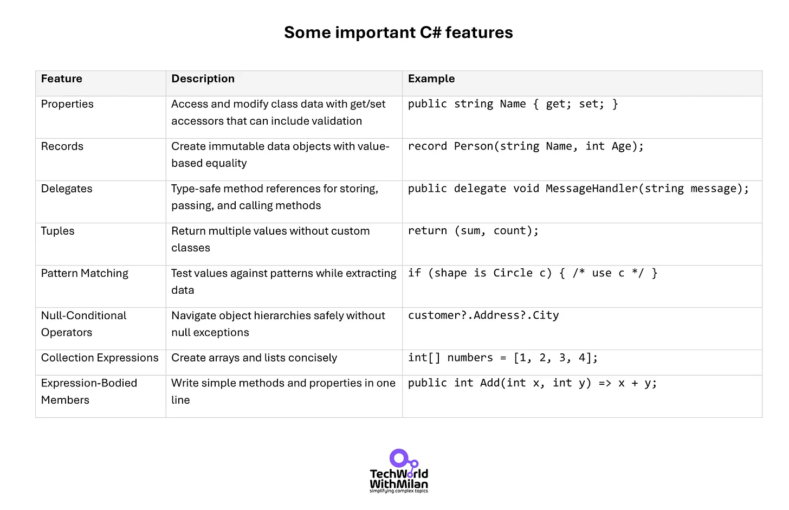

Muitos desses recursos não são apenas sintaxe conveniente, mas implementações integradas de **padrões de design** estabelecidos:

- Combinado com [yield](https://learn.microsoft.com/en-us/dotnet/csharp/language-reference/statements/yield), as interfaces `IEnumerable`/`IEnumerator` implementam o **padrão Iterator**.
- Os eventos fornecem uma implementação do **padrão Observer**.
- Os delegados oferecem uma abordagem funcional aos **padrões de estratégia e fábrica**.
- Emparelhado com `IDisposable`, a instrução cria um **padrão de gerenciamento de recursos** limpo.

Ao incorporar esses padrões diretamente na linguagem, o C# facilita a implementação de práticas de design robustas.

> 👉 _Saiba mais sobre como usar Padrões de Design com C# no **[meu livro](https://www.patreon.com/techworld_with_milan/shop/design-patterns-in-use-e-book-312304?utm_medium=clipboard_copy&utm_source=copyLink&utm_campaign=productshare_creator&utm_content=join_link)**._

## 3. O ecossistema .NET

Uma linguagem de programação não existe isoladamente — ela roda em uma plataforma e vem com ferramentas e bibliotecas. Um dos principais motivos para escolher C# para muitos de nós não são apenas os recursos da linguagem, mas o ecossistema .NET que envolve o C#.

C# é a linguagem principal do .NET e, como tal, desfruta de todos os benefícios de um dos ecossistemas de desenvolvedores mais completos.

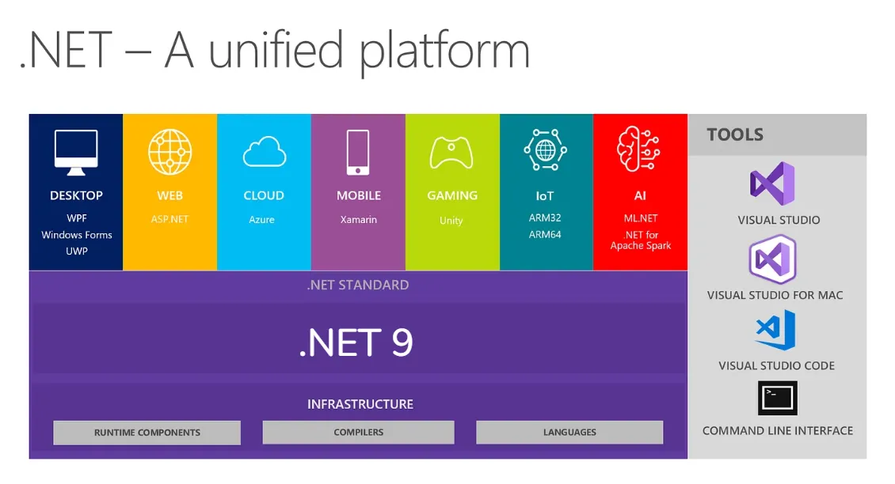

O desenvolvimento em C# está profundamente enraizado no ecossistema .NET, uma plataforma que a Microsoft fornece para a construção e execução de aplicações. Historicamente, o **[.NET Framework](https://dotnet.microsoft.com/en-us/learn/dotnet/what-is-dotnet-framework)** foi a implementação original do .NET, voltada para o sistema operacional Windows. Ele oferecia um rico conjunto de bibliotecas e um ambiente de execução para a construção de diversas aplicações, incluindo aplicativos de desktop para Windows, aplicações web usando ASP.NET e serviços web.

Em resposta à necessidade de desenvolvimento multiplataforma, a Microsoft lançou o **.NET Core** em 2016 — esta implementação moderna do .NET é [de código aberto](https://dotnet.microsoft.com/en-us/platform/open-source) e projetada para rodar em Windows, macOS e Linux.

Desde então, a Microsoft unificou essas plataformas lançando o .NET 5 em 2020 e versões subsequentes.

Em um nível alto, atualmente o ecossistema .NET fornece os seguintes **[tempos de execução](https://learn.microsoft.com/en-us/dotnet/fundamentals/implementations)**:

- **.[NET 9](https://devblogs.microsoft.com/dotnet/announcing-dotnet-9/)** (ASP.NET Core, WPF, Windows Forms, Blazor). Uma plataforma unificadora para aplicativos de desktop, web, nuvem, dispositivos móveis, jogos, IoT e IA.

- **[UWP](https://learn.microsoft.com/en-us/windows/uwp/get-started/universal-application-platform-guide)** [(Plataforma Universal do Windows)](https://learn.microsoft.com/en-us/windows/uwp/get-started/universal-application-platform-guide). Implementa o .NET para criar aplicativos e softwares Windows modernos e sensíveis ao toque para a Internet das Coisas (IoT).

- **[Mono](https://www.mono-project.com/)** A implementação .NET é usada principalmente quando um tempo de execução pequeno é necessário. Aplicativos Xamarin com tempo de execução (agora sem suporte) estão disponíveis para Android, macOS, iOS, tvOS e watchOS.

Todos os tempos de execução utilizam ferramentas e infraestrutura para compilar e executar código. Isso inclui linguagens (C#, Visual Basic), compiladores (Roslyn), coleta de lixo e ferramentas de compilação como MS Build ou Core CLR.

Além das bibliotecas de tempo de execução e base, o .NET inclui **estruturas especializadas** para diferentes modelos de aplicativos:

- **Web:** [ASP.NET Core](https://dotnet.microsoft.com/en-us/apps/aspnet) para construir aplicações web e APIs. Hoje, o ASP.NET Core é um framework rápido e modular para construir APIs web, aplicações web (usando MVC ou Razor Pages) e até aplicações em tempo real (com [SignalR](https://dotnet.microsoft.com/en-us/apps/aspnet/signalr)).

- **[Blazor](https://dotnet.microsoft.com/en-us/apps/aspnet/web-apps/blazor)** merece atenção especial como uma das adições recentes mais revolucionárias ao ecossistema .NET. Ele permite que desenvolvedores **construam aplicações web do lado do cliente usando C# em vez de JavaScript** usando a tecnologia WebAssembly. Isso permite que desenvolvedores C# usem suas habilidades existentes para desenvolvimento front-end, permitindo que criemos aplicações C# full-stack sem alternar o contexto entre as linguagens.

- **Área de trabalho:** [Windows Presentation Foundation](https://learn.microsoft.com/en-us/dotnet/desktop/wpf/overview/?view=netdesktop-9.0) (WPF) e [Windows Forms](https://learn.microsoft.com/en-us/dotnet/desktop/winforms/overview/?view=netdesktop-9.0) para aplicativos de área de trabalho do Windows (com suporte no .NET 6+ para Windows) e .[NET MAUI](https://dotnet.microsoft.com/en-us/apps/maui) (Interface de usuário de aplicativo multiplataforma) para aplicativos cliente multiplataforma (a evolução do Xamarin Forms).

- **Mobile:** Xamarin (agora integrado como .NET para iOS/Android via **[MAUI](https://dotnet.microsoft.com/en-us/apps/maui)**) para aplicativos móveis nativos.

- **Nuvem e serviços:** Bibliotecas para criar microsserviços, serviços gRPC e integrações de nuvem (especialmente com SDKs do Azure).

- **Desenvolvimento de jogos:** **[Unity](https://unity.com/)** usa uma versão personalizada do runtime .NET Mono para scripts, e a Unreal Engine pode usar .NET por meio de plugins de terceiros. O Unity tem sido usado para desenvolver uma grande porcentagem de jogos para dispositivos móveis (algumas estatísticas indicam mais de 50% dos jogos para dispositivos móveis e uma fração significativa dos jogos independentes para PC/console).

- **Ciência de dados e IA:** O .NET inclui [ML.NET](https://dotnet.microsoft.com/en-us/apps/ai/ml-dotnet) para aprendizado de máquina e pode interoperar com Python ou R para computação científica. Há até mesmo o [.NET para Apache Spark](https://learn.microsoft.com/en-us/azure/synapse-analytics/spark/spark-dotnet), permitindo que você escreva tarefas do Spark em C#.

- **IoT:** o .NET pode ser executado no Raspberry Pi e dispositivos similares (com o .NET 6+ suportando ARM64/ARM32), e há um [.NET NanoFramework](https://nanoframework.net/) menor para microcontroladores.

O ecossistema suporta diversas linguagens (C#, F#, VB), todas compiladas para IL e executadas no ambiente de execução .NET. Esse suporte a múltiplas linguagens permite que os desenvolvedores escolham diferentes paradigmas de programação (orientada a objetos, funcional, etc.) e, ao mesmo tempo, mantenham a mesma plataforma.

Isso é algo que você raramente vê em qualquer outra plataforma.

> ** 📌 Observação: o desenvolvimento da linguagem C# segue estas [diretrizes estratégicas principais](https://learn.microsoft.com/en-us/dotnet/csharp/tour-of-csharp/strategy):**
>
> 1. Inovar amplamente em **colaboração** com equipes do ecossistema .NET, enfatizando melhorias de produtividade, legibilidade e desempenho.
>
> 2. Mantenha a consistência com os **princípios** originais do C#, priorizando recursos intuitivos para desenvolvedores existentes.
>
> 3. Favoreça **melhorias** que beneficiem a maioria dos desenvolvedores em diversas cargas de trabalho e plataformas.
>
> 4. Mantenha uma forte **compatibilidade com versões anteriores**, avaliando cuidadosamente e limitando mudanças disruptivas.
>
> 5. Oriente a evolução da linguagem **abertamente**, considerando propostas e feedback da comunidade, mantendo a administração do design final.

## 4. Ferramentas

Uma das alegrias de trabalhar com C# para mim é o **excelente suporte de ferramentas**.

### Microsoft Visual Studio

O **[Microsoft Visual Studio](https://visualstudio.microsoft.com/)** é considerado há muito tempo um IDE de primeira linha (alguns o chamam de Mercedes no mundo dos IDEs). Ele possui recursos como o IntelliSense (completamento automático de código e documentação), um excelente depurador, designers de interface do usuário, ferramentas de teste integradas, criadores de perfil de desempenho e muito mais. Para muitos, os recursos de produtividade do Visual Studio são um grande motivo para escolher C#/.NET em vez de outros ecossistemas.

[](https://substackcdn.com/image/fetch/f_auto,q_auto:good,fl_progressive:steep/https%3A%2F%2Fsubstack-post-media.s3.amazonaws.com%2Fpublic%2Fimages%2F535b76fb-8f3a-4951-b558-0ffb42f17b85_1436x1072.png)

### Visual Studio Code

Há também o **[Visual Studio Code](https://code.visualstudio.com/)**(um editor leve e multiplataforma), que, com a extensão C# (agora aprimorada pelo [C# Dev Kit da Microsoft](https://learn.microsoft.com/en-us/visualstudio/subscriptions/vs-c-sharp-dev-kit)) e muitas [extensões](https://code.visualstudio.com/docs/configure/extensions/extension-marketplace), proporciona uma ótima experiência de desenvolvimento no Windows, Linux ou Mac. A Microsoft também o desenvolveu e é de código aberto.

[](https://substackcdn.com/image/fetch/f_auto,q_auto:good,fl_progressive:steep/https%3A%2F%2Fsubstack-post-media.s3.amazonaws.com%2Fpublic%2Fimages%2F1eec024d-fc37-4ca3-a4e9-f95401f2dd24_1200x796.png)

### JetBrains Rider

**[JetBrains Rider](https://www.jetbrains.com/rider/)** é um excelente IDE multiplataforma para C# para quem prefere ferramentas de terceiros. Ele tem ótimo desempenho e funciona nas maiores soluções C#. Também é gratuito para uso não comercial.

[](https://substackcdn.com/image/fetch/f_auto,q_auto:good,fl_progressive:steep/https%3A%2F%2Fsubstack-post-media.s3.amazonaws.com%2Fpublic%2Fimages%2F18202f38-7d9c-4152-b5db-5033f312f178_2480x1323.png)

### Ferramentas de construção

As **ferramentas de compilação** ([compilador Roslyn](https://github.com/dotnet/roslyn) e [MSBuild](https://github.com/dotnet/msbuild)) funcionam em segundo plano para gerenciar dependências e compilação. Configurar um novo projeto geralmente é tão simples quanto alguns cliques ou comandos (`dotnet new console -o MyApp` criará um novo aplicativo de console por meio da CLI do .NET).

### CLI .NET

O **[.NET CLI](https://learn.microsoft.com/en-us/dotnet/core/tools/)** é uma poderosa interface de linha de comando para criar, executar, testar e publicar aplicativos .NET, o que permite fácil automação e integração de CI/CD.

[](https://substackcdn.com/image/fetch/f_auto,q_auto:good,fl_progressive:steep/https%3A%2F%2Fsubstack-post-media.s3.amazonaws.com%2Fpublic%2Fimages%2Fe4254bc3-db29-4f44-9f52-f2c5d38bc8a5_1210x622.png)

### Outras ferramentas

O C# também se beneficia de recursos como **editar e continuar** durante a depuração (modificar código enquanto pausado em um ponto de interrupção), **ferramentas de refatoração** avançadas (renomear símbolos, extrair métodos, etc.) e **[analisadores](https://learn.microsoft.com/en-us/visualstudio/code-quality/roslyn-analyzers-overview?view=vs-2022)** que detectam problemas comuns ou desvios de estilo conforme você digita.

Editores modernos podem até usar **[Analisadores Roslyn](https://learn.microsoft.com/en-us/visualstudio/code-quality/roslyn-analyzers-overview?view=vs-2022)** para sugerir correções (por exemplo, sugestões de "usar LINQ em vez deste loop" ou "remover conversões desnecessárias"). O nível de refinamento das ferramentas para desenvolvedores é imbatível, melhorando significativamente a produtividade dos desenvolvedores.

A combinação do design da linguagem C# com essas ferramentas poderosas cria um ambiente explicitamente focado na produtividade do desenvolvedor. A natureza fortemente tipada do C# permite que essas ferramentas forneçam recursos avançados de análise de código, verificação de erros e refatoração que seriam difíceis de implementar em linguagens mais dinâmicas.

## 5. Bibliotecas

A linguagem C# é apenas uma parte do valor; as **[bibliotecas de classes .NET](https://learn.microsoft.com/en-us/dotnet/standard/class-library-overview)** fornecem muita funcionalidade.

A biblioteca padrão abrange tudo, desde coleções até E/S de arquivos, redes, criptografia, threading, tratamento de XML/JSON e expressões regulares. A Microsoft a disponibiliza prontamente e **[documenta](https://learn.microsoft.com/en-us/dotnet/)** a ela.

Isso significa que você pode fazer muita coisa sem precisar de bibliotecas de terceiros. Quando não precisar de ajuda externa, você sempre pode usar o **[ecossistema de pacotes NuGet](https://www.nuget.org/)**.

Em 2025, o [NuGet.org](https://www.nuget.org/) teve um crescimento explosivo, com mais de 600 bilhões de downloads registrados e mais de 448 mil pacotes. Isso ilustra a forte dependência dos desenvolvedores .NET em bibliotecas compartilhadas.

[](https://substackcdn.com/image/fetch/f_auto,q_auto:good,fl_progressive:steep/https%3A%2F%2Fsubstack-post-media.s3.amazonaws.com%2Fpublic%2Fimages%2F7644097b-ef83-499e-9464-cee485a9e821_815x387.png)

Algumas bibliotecas NuGet populares são:

- **[MediatR](https://github.com/jbogard/MediatR)** \- Implementação do padrão Mediator em .NET
- **[Polly](https://github.com/App-vNext/Polly)** \- Uma biblioteca de tratamento de falhas que permite a expressão de políticas como Retry e Circuit Breaker.
- **[Fluent Validation](https://github.com/JeremySkinner/FluentValidation)** \- Biblioteca de validação .NET para criar regras de validação fortemente tipadas.
- **[Benchmark.NET](https://github.com/dotnet/BenchmarkDotNet)** \- Biblioteca .NET para benchmarking.
- **[Refit](https://github.com/reactiveui/refit)** \- Transforma sua API REST em uma interface ativa.
- **[YARP](https://microsoft.github.io/reverse-proxy/)** \- Servidor proxy reverso.

## 6. Documentação

A documentação da Microsoft para C# e .NET (disponível em **[learn.microsoft.com](https://learn.microsoft.com)**) é geralmente excelente, com documentos conceituais, tutoriais e referências completas de API.

Os documentos oficiais são atualizados regularmente para novos recursos (por exemplo, quando o [C# 12](https://learn.microsoft.com/en-us/dotnet/csharp/whats-new/csharp-12) ou [13](https://learn.microsoft.com/en-us/dotnet/csharp/whats-new/csharp-13) foi lançado, os documentos estavam prontos, explicando os novos recursos.

Esta **documentação abrangente e atualizada** para todos os recursos é extremamente valiosa, especialmente em comparação a alguns ecossistemas abertos, onde você depende mais de wikis da comunidade ou postagens de blog dispersas.

Se você estiver interessado em explorar C#, aqui estão alguns recursos para você começar:

- Instale o .NET a partir da **[página oficial de download](https://dotnet.microsoft.com/download)**
- Explore **[os tutoriais de C# do Microsoft Learn](https://learn.microsoft.com/en-us/dotnet/csharp/)**
- Tente construir uma API web simples com **[ASP.NET Core](https://learn.microsoft.com/en-us/aspnet/core/)**
- Para desenvolvimento de jogos, confira **[Unity Learn](https://learn.unity.com/)**
- Verifique a **[especificação oficial do C#](https://learn.microsoft.com/en-us/dotnet/csharp/specification/)**.
- **[Regras e convenções de nomenclatura de identificadores C#](https://learn.microsoft.com/en-us/dotnet/csharp/fundamentals/coding-style/identifier-names)** e as **[convenções de codificação C#](https://learn.microsoft.com/en-us/dotnet/csharp/fundamentals/coding-style/coding-conventions)**.

Outro ponto forte do C# é que ele suporta **aprendizado progressivo**. Os desenvolvedores podem começar a escrever código aplicável com apenas um pequeno subconjunto dos recursos da linguagem e expandir seus conhecimentos à medida que se tornam mais proficientes. Essa curva de aprendizado gradual torna o C# acessível para iniciantes, mas ainda oferece a profundidade de que precisamos como desenvolvedores experientes.

Para quem busca se aprofundar, recomendo os seguintes livros:

- "**[C# em Profundidade](https://amzn.to/3Ersyji)**" por Jon Skeet para uma compreensão profunda da linguagem
- "**[ASP.NET Core em ação](https://amzn.to/3Yb4iIW)**" por Andrew Lock para desenvolvimento web
- "**[Concorrência em C# Cookbook](https://amzn.to/42DgLGr)**" por Stephen Cleary para programação assíncrona avançada

> ➡ ️ Confira aqui meus **recursos de aprendizagem recomendados para .NET e C#**:

[Newsletter Tech World With Milan<br>Recursos de aprendizagem recomendados para C# e .NET em 2025.<br>A partir de 2025, o ecossistema .NET continua a prosperar, com o .NET 9 trazendo atualizações poderosas e o C# permanecendo como a principal escolha para desenvolvedores. Na recente pesquisa Stack Overflow Developer Survey 2024, .NET foi a biblioteca mais amada (fora da web…<br>Leia mais<br>Há 2 meses · 56 curtidas · Dr. Milan Milanović](https://newsletter.techworld-with-milan.com/p/recommended-learning-resources-for?utm_source=substack&utm_campaign=post_embed&utm_medium=web)

Incluindo meu **[.NET Developer Roadmap](https://github.com/milanm/DotNet-Developer-Roadmap)** completo em um repositório ativo do GitHub:

[](https://github.com/milanm/DotNet-Developer-Roadmaphttps://github.com/milanm/DotNet-Developer-Roadmap)

[Roteiro para desenvolvedores .NET](https://github.com/milanm/DotNet-Developer-Roadmap)

## 7. Comunidade

C# e .NET desfrutam de uma **comunidade vibrante e forte suporte corporativo**. Este é provavelmente um dos principais motivos pelos quais decidi me dedicar ao mundo do C# e .NET por todos esses anos.

No âmbito corporativo, a Microsoft investe pesado em C#/.NET. O fato de o C# ser de código aberto significa que, mesmo fora da Microsoft, muitos colaboradores em todo o mundo ajudam a aprimorá-lo.

O processo de design da linguagem é público – você pode acompanhá-lo no **[dotnet/csharplang GitHub](https://github.com/dotnet/csharplang)**, ler propostas, dar feedback ou até mesmo contribuir. Esse diálogo aberto entre a equipe de design do C# e a comunidade foi destacado como um ponto forte: _“Há comunicação e discussão abertas entre a equipe de design da linguagem e a comunidade.”_

Isso significa que a linguagem tende a evoluir de maneiras que atendem às necessidades do mundo real, muitas vezes influenciadas por propostas da comunidade.

Aqui estão algumas das iniciativas e recursos comunitários mais notáveis:

- **[.NET Foundation](https://dotnetfoundation.org/)** – Uma organização independente e sem fins lucrativos que promove o desenvolvimento aberto e a colaboração em todo o ecossistema .NET, incluindo C#. A Fundação apoia centenas de projetos de código aberto, ajuda a organizar encontros locais e online sobre .NET e fornece recursos para líderes comunitários e colaboradores.
- **[.NET Community Toolkit](https://learn.microsoft.com/en-us/dotnet/communitytoolkit/)** – Uma coleção de auxiliares e APIs de código aberto para todos os desenvolvedores .NET, mantida pela Microsoft e pela comunidade. Inclui ferramentas para desenvolvimento MVVM, cenários de alto desempenho, diagnósticos e muito mais.
- **[Reddit](https://www.reddit.com/r/dotnet/)**. O subreddit r/csharp é um hub com mais de 200.000 membros. Ele oferece discussões diárias, perguntas e respostas e um tópico semanal "Pergunte o que quiser".
- **[Grupo C# Discord](https://discord.com/servers/c-143867839282020352)** – Um servidor Discord com milhares de membros, oferecendo desafios, projetos colaborativos, grupos de aprendizagem e um ambiente de suporte para alunos e desenvolvedores C# de todos os níveis.
- **[Encontros locais e globais](https://dotnetfoundation.org/community/.net-meetups)** \- A .NET Foundation apoia centenas de grupos locais de usuários .NET e encontros em todo o mundo. Esses grupos organizam regularmente eventos, workshops e oportunidades de networking.
- **[Programa Microsoft MVP](https://mvp.microsoft.com/en-us/mvp)** \- A Microsoft reconhece colaboradores excepcionais da comunidade com o prêmio Microsoft MVP (Most Valuable Professional). Este programa reúne defensores apaixonados de C# e .NET que compartilham sua expertise por meio de palestras, blogs e mentorias. Um MVP da Microsoft escreveu este texto 😊.
- **As conferências da Microsoft ([.NET Conf](https://www.dotnetconf.net/) e [Microsoft Build](https://build.microsoft.com/en-US/home))** são eventos importantes que anunciam os avanços mais recentes em .NET e C#. A comunidade se reúne para aprender, fazer networking e compartilhar conhecimento. A .NET Conf, em particular, é um evento global emblemático organizado pela Microsoft e pela comunidade. Todo mês de novembro, novas edições de C# e .NET são anunciadas.

Apesar do seu tamanho, a comunidade C# é frequentemente descrita como acolhedora, apaixonada e pragmática. Desenvolvedores frequentemente expressam entusiasmo genuíno pela linguagem e seu ecossistema, citando o prazer de escrever "**código bonito**", a inovação contínua e a sensação de produtividade que isso traz.

Há uma **forte cultura de compartilhamento de conhecimento**, com muitos desenvolvedores contribuindo para o código aberto, escrevendo tutoriais ou ajudando outros em fóruns e mídias sociais.

[](https://substackcdn.com/image/fetch/f_auto,q_auto:good,fl_progressive:steep/https%3A%2F%2Fsubstack-post-media.s3.amazonaws.com%2Fpublic%2Fimages%2F643915f3-93a1-480b-9944-6d9adf1a8133_891x576.jpeg)

Uma panorâmica com todos os MVPs da Microsoft no **MVP Summit 2025** deste ano

8. O concurso de popularidade

C# está consistentemente classificada entre as linguagens de programação mais utilizadas no mundo. Na [Pesquisa de Desenvolvedores do Stack Overflow 2024,](https://survey.stackoverflow.co/2024/), ficou em 8º lugar. Na categoria "Outros frameworks e bibliotecas" (https://survey.stackoverflow.co/2024/technology#most-popular-technologies-misc-tech), o .NET está em primeiro lugar.

[I](https://www.tiobe.com/tiobe-index/) atualmente (em 2025) ocupa o 5º lugar no índice TIOBE e [PyPL](https://pypl.github.io/PYPL.html). Em 2023, recebeu o prêmio "**[Linguagem de Programação do Ano](https://news.ycombinator.com/item?id=38899521)**".

[](https://substackcdn.com/image/fetch/f_auto,q_a uto:good,fl_progressive:steep/https%3A%2F%2Fsubstack-post-media.s3.amazonaws.com%2Fpublic%2Fimages%2Feca019e9-3033-44fa-a4dd-dc8074438e73_1339x438.png)

Do ponto de vista do **mercado de trabalho**, as habilidades em C# são muito procuradas, principalmente em ambientes corporativos, desenvolvimento de jogos com Unity e desenvolvimento web. Os sites de empregos mostram que desenvolvedores em C# recebem salários competitivos, com salários medianos frequentemente superiores aos de muitas outras linguagens de programação. C# foi classificada em 4º lugar no DevJobsScanner "**[As 8 Linguagens de Programação Mais Demandadas em 2024](https://www.devjobsscanner.com/blog/top-8-most-demanded-programming-languages/)**", que analisou os últimos 21 meses e 12 milhões de vagas de desenvolvedor.

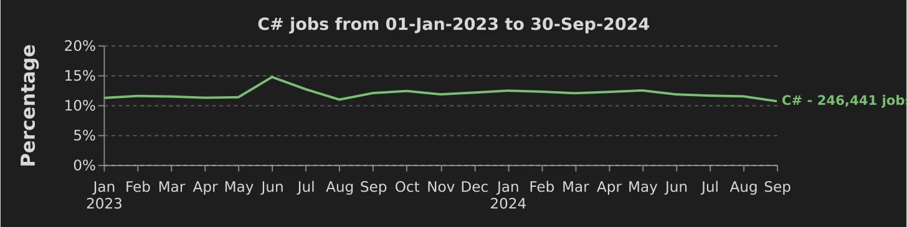

Vagas de emprego em C# de 1º de janeiro de 2023 a 30 de setembro de 2024 (Fonte: [DevJobsScanner](https://www.devjobsscanner.com/blog/top-8-most-demanded-programming-languages/))

Claro, precisamos falar sobre salários também. Os melhores engenheiros C# ganham mais de **US$ 120 mil** nos EUA ([DevItJobs](https://devitjobs.com/salaries/dotNET/all/all/all)) e **US$ 110 mil** na Europa ([Dreamix](https://dreamix.eu/insights/c-sharp-dot-net-developer-salary-by-country/)). Algumas [fontes](https://rubyonremote.com/c-sharp-developer-salaries/), especialmente aquelas focadas em funções remotas ou de alta demanda, relatam salários médios para desenvolvedores C# de até **US$ 156.430**, com os maiores salários chegando a **até US$ 301.100 por ano**.

Em [empresas líderes](https://beincrypto.com/jobs/salary/c-sharp/), os salários de desenvolvedores C# podem ser ainda maiores. Por exemplo, a OKX oferece até **US$ 213.000 por ano** e a Limit Break oferece até **US$ 205.000** por ano para os melhores desenvolvedores C#. Com o C# sendo usado na web, na nuvem, em empresas e até mesmo em jogos, vale a pena se aprimorar e almejar estar entre os 10% melhores.

No entanto, popularidade não é tudo. O que importa mais é se uma linguagem é apropriada para suas necessidades específicas, se você gosta de trabalhar com ela e se ela tem um futuro sustentável. Em todas essas frentes, C# parece forte.

> **Observação**: _Leve em consideração que há [críticas ao índice TIOBE](https://nindalf.com/posts/stop-citing-tiobe/)._

9. C# vs outras linguagens

A imagem do C# não estaria completa sem compará-lo aos principais concorrentes do mercado. Então, vamos ver como ele se sai.

### C# vs Java

Historicamente vistas como rivais, C# e Java são hoje linguagens maduras, de alto desempenho e orientadas a objetos, amplamente utilizadas em backends corporativos. Embora ambas compartilhem uma sintaxe no estilo C e sejam usadas para construir uma ampla gama de aplicações, elas apresentam características diferentes hoje.

C# possui recursos de linguagem mais modernos, como propriedades, sobrecarga de operadores, Consulta Integrada à Linguagem (LINQ) e programação assíncrona com async/await. Isso pode resultar em **código mais conciso e expressivo** do que a sintaxe mais verbosa do Java e diferentes abordagens para funcionalidades semelhantes.

Ambas possuem coleta de lixo e compilação JIT, com características de desempenho semelhantes. Uma grande diferença é o ecossistema: **Java tem um amplo ecossistema aberto e múltiplas implementações concorrentes** (OpenJDK, Oracle JDK), **enquanto C# tem um ecossistema mais unificado sob .NET** (embora Mono/Xamarin existissem, agora unificados com o núcleo).

Ferramentas para C# (Visual Studio/Rider) vs. Java (IntelliJ/Eclipse) – ambas boas, embora muitos considerem Visual Studio + ReSharper ou Rider extremamente produtivos. Java se destaca pelo princípio "escreva uma vez, execute em qualquer lugar" e domina algumas áreas (como Android, que usa Java/Kotlin, embora agora o .NET MAUI também possa ser usado em Android).

C# é frequentemente visto como mais _elegante_ e moderno em design, já que aprendeu com os erros do Java e se mostrou mais disposto a evoluir rapidamente. Há uma piada amigável que diz que **C# é o que Java seria se tivesse alma** – subjetivo, mas mostra que muitos que usam ambos tendem a preferir a sensação e as conveniências do C#. Por outro lado, a simplicidade do Java (por não ter muitos recursos da linguagem) pode beneficiar algumas equipes, reduzindo a complexidade.

[](https://substackcdn.com/image/fetch/f_auto,q_auto:good,fl_progressive:steep/https%3A%2F%2Fsubstack-post-media.s3.amazonaws.com%2Fpublic%2Fimages%2F2a207f4a-93f1-47f2-b58b-1a51b08d0326_2132x1025.png)

C# vs Java no Google Trends (últimos 5 anos)

> ➡ ️ [Aprenda C# para desenvolvedores Java](https://learn.microsoft.com/en-us/dotnet/csharp/tour-of-csharp/tips-for-java-developers).

### C# vs Python

Essas duas são bem diferentes – uma é estaticamente tipada e compilada (para IL), a outra é dinamicamente tipada e interpretada (com algumas exceções). **Python** se destaca em scripts rápidos, sintaxe simples e no ecossistema de ciência de dados, por isso muitos a consideram a rainha das linguagens de programação hoje.

**C#** se destaca em engenharia de aplicação abrangente, desempenho e ferramentas robustas. Em termos de desempenho, **[C# geralmente supera em muito Python](https://www.codeporting.com/blog/csharp_vs_python_a_look_at_performance_syntax_and_key_differences#:~:text=C,and%20its%20mature%20JIT) para tarefas que exigem muita CPU** (devido à otimização JIT e à tipagem estática, que permitem melhores otimizações).

C# também permite controle de baixo nível (código inseguro, Span<T>, etc.) para otimizar caminhos críticos, enquanto Python frequentemente depende de extensões C para velocidade. Enquanto Python tem um REPL forte e uso interativo, C# historicamente não tinha um REPL convencional (embora exista um como C# Interactive, e notebooks via .NET Interactive agora permitem interatividade semelhante).

Com instruções de alto nível e suporte a scripts, C# ficou mais fácil, mas **Python ainda vence para scripts rápidos e únicos** ou quando você precisa de uma vasta gama de bibliotecas científicas. Dito isso, a lacuna está diminuindo – por exemplo, você pode usar notebooks Jupyter com C# (via .NET Interactive) para exploração de dados, e bibliotecas como a pilha SciSharp tentam portar parte do NumPy, etc., para .NET.

**Python é frequentemente recomendado para iniciantes** devido à sua sintaxe simples, enquanto C# pode exigir mais aprendizado devido ao seu sistema de tipos e recursos. No entanto, o C# moderno com ferramentas como o Visual Studio também pode ser muito amigável para iniciantes (o Intellisense e as verificações em tempo de compilação o orientarão).

[](https://substackcdn.com/image/fetch/f_auto,q_a uto:good,fl_progressive:steep/https%3A%2F%2Fsubstack-post-media.s3.amazonaws.com%2Fpublic%2Fimages%2Fe38c0112-0727-43d6-97fc-8c6d9d04d3ab_2132x992.png)

C# vs Python no Google Trends (últimos 5 anos)

> ➡ ️ [Aprenda C# para desenvolvedores Python](https://learn.microsoft.com/en-us/dotnet/csharp/tour-of-csharp/tips-for-python-developers).

### C# vs F#

Uma coisa é a mesma para ambos: eles rodam em .NET. **F#** é uma linguagem funcional (também multiparadigma, mas otimizada para FP) com inferência de tipos, imutabilidade por padrão e sintaxe simples. F# pode frequentemente expressar algoritmos ou modelos de domínio específicos com mais clareza do que C# (por exemplo, uniões discriminadas e correspondência de padrões em adições de C# inspiradas em F#).

No entanto, **C# é muito mais popular e possui mais bibliotecas** escritas explicitamente. Muitas empresas .NET usam C# para fins gerais e F# para tarefas específicas em que ele se destaca (como mecanismos de cálculo complexos, lógica específica de domínio ou simplesmente por preferência em serviços menores).

A escolha entre C# e F# pode ser uma questão de **preferência de paradigma**: se você gosta de programação funcional, F# oferece isso com total interoperabilidade com .NET. Se você prefere ou precisa de uma **mistura de paradigmas e amplo suporte da comunidade**, C# é uma escolha melhor.

Curiosamente, **recursos do F# migraram para o C#** (por exemplo, registros, correspondência de padrões), estreitando um pouco a lacuna. Mas o F# ainda tem vantagens como sintaxe lambda sucinta, inferência de tipos em todos os lugares (o `var` do C# é uma inferência de tipos limitada) e recursos complexos de tipos (expressões computacionais, etc.).

Alguns desenvolvedores recomendam usar F# para a lógica do domínio principal (para correção e concisão) e C# para interface com frameworks (como UI, ou onde a POO faz mais sentido). Não há um vencedor; eles se complementam. A boa notícia é que você pode combiná-los em um projeto, se necessário.

[](https://substackcdn.com/image/fetch/f_auto,q_auto:good,fl_progressive:steep/https%3A%2F%2Fsubstack-post-media.s3.amazonaws.com%2Fpublic%2Fimages%2Faa7c857e-1805-41c5-9ba1-783c6a938c1f_373x203.png)

### C# vs JavaScript/TypeScript

JavaScript é o rei do front-end web, mas o Node.js (JS) compete com o ASP.NET Core (C#) no back-end (e [o ASP.NET Core vence em benchmarks independentes](https://www.techempower.com/benchmarks/#section=data-r23)). A vantagem do Node é sua linguagem unificada (JS) para front-end e back-end, bem como seu enorme ecossistema npm.

No entanto, muitos acham **C# com ASP.NET mais robusto para APIs grandes**, e o TypeScript (que adiciona tipos estáticos ao JS) essencialmente tenta trazer alguns dos benefícios que o C# tem para o mundo JS.

Curiosamente, com **[Blazor](https://dotnet.microsoft.com/en-us/apps/aspnet/web-apps/blazor)**, você pode até usar C# para escrever um front-end web (baseado em WebAssembly) em vez de JavaScript, o que é um caminho promissor para quem deseja adotar C# full-stack. Não é tão amplamente adotado quanto os frameworks JavaScript, mas é um exemplo da abordagem inovadora do .NET (adotando o WebAssembly).

Em relação ao desempenho, **[C# no servidor tende a superar o Node.js em tarefas que exigem muita CPU](https://www.sitepoint.com/node-js-vs-net-core-what-to-choose/)** devido à natureza single-thread do Node. No entanto, o Node lida muito bem com simultaneidade de E/S. C# também lida muito bem com simultaneidade de E/S com async/await (e usando múltiplas threads ou threads de E/S), então é mais uma questão de preferência e do ecossistema existente.

Para a experiência do desenvolvedor, depurar C# no Visual Studio é geralmente mais fácil do que depurar Node.js devido a ferramentas melhores e tipagem estática. O TypeScript nivelou o campo ao detectar erros para desenvolvedores de JS durante o tempo de compilação (e está sendo desenvolvido pelo mesmo autor do C#).

No entanto, se alguém já for um desenvolvedor .NET/C#, ele pode preferir usar C# para o back-end e possivelmente o front-end (via Blazor) para evitar mudar o contexto para JavaScript.

[](https://substackcdn.com/image/fetch/f_auto,q_auto:good,fl_progressive:steep/https%3A%2F%2Fsubstack-post-media.s3.amazonaws.com%2Fpublic%2Fimages%2F7ef9da46-9bab-4f73-9907-b8433bc338c6_2132x1016.png)

C# vs JavaScript no Google Trends (últimos 5 anos)

> 👉 [Aprenda C# para desenvolvedores JavaScript](https://learn.microsoft.com/en-us/dotnet/csharp/tour-of-csharp/tips-for-javascript-developers).

Aqui está a comparação completa entre essas quatro línguas:

[](https://substackcdn.com/image/fetch/f_auto,q_auto:good,fl_progressive:steep/https%3A%2F%2Fsubstack-post-media.s3.amazonaws.com%2Fpublic%2Fimages%2Fd82b85d2-5672-45b5-b8b9-b3df1533569c_1674x938.png)

Portanto, podemos dizer que C# se destaca ou se destaca em muitas áreas em relação a outras linguagens. Pode não ser tão minimalista ou dinâmico quanto Python, mas oferece desempenho e estrutura para aplicativos grandes. Pode não ser tão puramente funcional quanto F#, mas equilibra paradigmas e utiliza muito mais, então é o melhor dos dois mundos.

> ** 📈 Como o .NET se compara em desempenho a outras linguagens e tempos de execução?**
>
> _[A TechEmpower publica](https://www.techempower.com/) um conjunto de benchmarks de código aberto que mede roteamento HTTP bruto, serialização JSON, leituras/gravações em banco de dados e modelos HTML sob hardware e ferramentas uniformes. A [Rodada 23](https://www.techempower.com/benchmarks/#section=data-r23) (março de 2025) é a execução completa mais recente e apresenta hardware de 40 GbE mais rápido, portanto, as pontuações não são diretamente comparáveis às rodadas anteriores._
>
> _Se examinarmos os resultados e excluirmos alguns runtimes experimentais e raramente utilizados, vemos que o modelo leve de goroutine do Go lidera o campo principal, seguido de perto **pelo pipeline otimizado do .NET 8**. Os clusters Node/TypeScript, Kotlin e Java estão no meio, e os ecossistemas (Elixir, Python, Ruby, PHP, Swift) trocam velocidade absoluta por ergonomia do desenvolvedor e bibliotecas ricas._
>
> _Podemos ver aqui que **ASP.NET Core Minimal APIs no .NET 8/9**—pontua **87** nessa escala:_
>
> - _apenas ~10% atrás de Go/Fiber (pontuação 100),_
>
> - _**≈3 × mais rápido** que o Node 20 + Fastify e o par JVM (Spring e Ktor),_
>
> - _**≈4 × mais rápido** que Elixir/Phoenix,_
>
> - _**≈7 × mais rápido** que Python/FastAPI,_
>
> - _**>20 × mais rápido** que Rails ou Laravel, e_
>
> - _**>40 × mais rápido** que Swift/Vapor._
>
> _Então, está claro que o .NET está quase no topo do jogo de desempenho porque o **Adaptive Server GC** (DATAS) aumenta ou diminui o heap em tempo real para reduzir o tempo de pausa durante rajadas; um compilador **JIT** em camadas, controlado por PGO, encurta o aquecimento e então otimiza novamente os caminhos mais ativos na produção; **APIs intrínsecas ao vetor** agora têm como alvo AVX-10 e Arm SVE, permitindo que loops estreitos mastiguem dados de oito polegadas de largura em um único tique; **Native AOT** corta IL não utilizado, **System.Text.Json** evita reflexão e copia menos bytes, então cada chamada REST aloca menos; e o roteador enxuto **Minimal API** introduzido no .NET 9 adiciona um aumento de taxa de transferência de aproximadamente 15% em relação ao MVC no mesmo hardware._
>
> _Juntos, esses ajustes permitem que o CLR gaste menos tempo estacionando threads, copiando buffers ou compilando código, e mais tempo atendendo seus usuários._
>
> [](https://substackcdn.com/image/fetch/f_auto,q_auto:good,fl_progressive:steep/https%3A%2F%2Fsubstack-post-media.s3.amazonaws.com%2Fpublic%2Fimages%2Fdbd8c2c5-5381-456f-899b-0b90bd72dee6_956x681.png)
>
> Comparação de frameworks da Web (fonte: [TechEmpower Round-23](https://www.techempower.com/benchmarks/#section=data-r23))

## 10. O futuro do C#

C# é uma linguagem que continua a evoluir rapidamente (já existe uma [versão prévia do C# 14](https://learn.microsoft.com/en-us/dotnet/csharp/whats-new/csharp-14)). A Microsoft lança novas versões todos os anos e apresenta recursos novos e poderosos para desenvolvedores.

Versões recentes introduziram inovações como **[registros](https://learn.microsoft.com/en-us/dotnet/csharp/whats-new/csharp-13)**, **[declarações de nível superior](https://learn.microsoft.com/en-us/dotnet/csharp/tutorials/top-level-statements)**, **[tratamento aprimorado de strings](https://learn.microsoft.com/en-us/dotnet/csharp/language-reference/proposals/csharp-10.0/improved-interpolated-strings)** e **[expressões de coleção concisas](https://learn.microsoft.com/en-us/dotnet/csharp/language-reference/operators/collection-expressions)**. Cada versão simplifica ainda mais as tarefas diárias e reduz o código repetitivo, tornando o desenvolvimento mais rápido e fácil.

A Microsoft tem uma **estratégia clara e proativa para evoluir a linguagem de programação C#.** A equipe C# colabora ativamente com as equipes responsáveis pelas bibliotecas .NET, ferramentas para desenvolvedores e suporte à carga de trabalho para introduzir novos recursos e aprimoramentos.

Um princípio fundamental que orienta essa evolução é priorizar melhorias de linguagem e desempenho que beneficiarão a maioria dos desenvolvedores de C#, considerando uma **ampla gama de domínios nos quais a linguagem é usada**.

Há também um **forte compromisso em manter a compatibilidade com versões anteriores**, considerando a grande quantidade de código C# em uso atualmente.

Dada a estratégia proativa da Microsoft e o envolvimento contínuo da comunidade, **o futuro do C# parece muito promissor**.

## 11. Conclusão

Então, **por que C#**?

O desempenho, a legibilidade, a versatilidade e o ecossistema robusto do C# o tornam uma boa escolha para muitos cenários de desenvolvimento atuais. De sua sintaxe concisa e expressiva a recursos poderosos como LINQ e async/await, **o C# ajuda os desenvolvedores a resolver problemas complexos com elegância e eficiência.**

A linguagem **não restringe você a um paradigma**. Dependendo das necessidades do seu projeto, você pode facilmente combinar programação orientada a objetos, programação funcional ou otimizações de baixo nível.

C# atinge o equilíbrio perfeito entre potência e acessibilidade. Ele permite que você **escreva código simples e legível para tarefas cotidianas, ao mesmo tempo em que oferece recursos avançados quando necessário**.

À medida que suas habilidades progridem, **C# cresce com você**, oferecendo recursos que ajudam a implementar padrões estabelecidos de forma correta e idiomática. A linguagem **incentiva boas práticas sem forçar complexidade desnecessária**, tornando-a adequada para iniciantes e desenvolvedores experientes.

Com o ecossistema .NET unificado, **você pode criar aplicativos multiplataforma com confiança** — desde web e mobile até desktop e serviços em nuvem. Ferramentas avançadas, bibliotecas abrangentes e uma grande comunidade (com o suporte da Microsoft) facilitam ainda mais o aprendizado e o desenvolvimento.

Claro, C# não é perfeito — nenhuma linguagem é. Pode parecer prolixo em comparação com linguagens de script mais simples e não é ideal para tarefas de nível extremamente baixo. Mas é **uma das linguagens mais produtivas e equilibradas disponíveis para a maioria das aplicações**, especialmente soluções corporativas, serviços web e desenvolvimento de jogos.

Para quem está em dúvida, **experimente C# no seu próximo projeto**. Experimente seus recursos, explore o ecossistema. Você provavelmente descobrirá, como eu, que ele atinge um ponto ideal que torna o desenvolvimento de software uma arte prazerosa.

C# me surpreende a cada nova versão, por isso continua sendo minha linguagem por muitos anos.

## 12. BÔNUS: Uma breve história do C#

Toda linguagem tem uma história de origem. A história do [C#](<https://en.wikipedia.org/wiki/C_Sharp_(programming_language)>) começa por volta de 2000, quando a Microsoft tentou criar uma nova linguagem para sua plataforma emergente .NET.

**Anders Hejlsberg**, um lendário arquiteto de linguagens (conhecido por Turbo Pascal e Delphi, que hoje lidera o desenvolvimento do TypeScript), liderou o projeto do C#. O objetivo era construir uma linguagem **segura em termos de tipos e orientada a objetos** que combinasse o poder e a robustez do C++ com a produtividade mais simples e de alto nível de linguagens como o Visual Basic.

> 💡 _O desenvolvimento inicial do C# foi chamado de "Cool" ou "Linguagem Orientada a Objetos semelhante ao C". No entanto, a Microsoft não manteve o nome por questões de marca registrada, mas ele realmente soa legal ;)._

Em essência, os designers queriam _“tudo de bom que há no Visual Basic e no C++”_ sem a complexidade e as armadilhas dessas linguagens. C# também foi concebido como uma resposta ao Java — a maneira da Microsoft de oferecer uma linguagem familiar de chaves para o novo milênio, mas com suas melhorias e sem algumas das limitações iniciais do Java (como as APIs corporativas incômodas da época).

Quando o C# 1.0 foi lançado (junto com o .NET 1.0 em 2002), ele estava **firmemente enraizado na programação orientada a objetos (POO)**. Assim como o Java, exigia que todo o código residisse dentro de classes. Apresentava coleta de lixo e um sistema de tipos robusto, eliminando a aritmética de ponteiros para um código mais seguro (embora um modo "inseguro" estivesse disponível para programação de sistemas quando necessário).

O _principal objetivo de design_ do C# era **simplicidade em vez de poder de baixo nível** – você poderia abrir mão de um pouco do controle manual do C/C++. Ainda assim, você ganharia segurança de memória (coleta de lixo) e desenvolvimento mais fácil.

Nas duas décadas seguintes, **C# evoluiu** e adicionou recursos a quase todos os lançamentos para permanecer moderno e relevante.

Aqui está um cronograma rápido de alguns marcos importantes:

- **C# 2.0 (2005)** – Introduziu **genéricos**, **iteradores** e classes parciais, melhorando significativamente a segurança de tipos e eliminando muitas tarefas repetitivas de codificação. (Os genéricos em C# surgiram quase ao mesmo tempo que os genéricos em Java, mas com uma diferença significativa que discutiremos mais tarde.)
- **C# 3.0 (2007)** – Um lançamento marcante que trouxe **expressões lambda**, **LINQ (Consulta Integrada à Linguagem)** e tipos anônimos. Foi nessa época que o C# começou a adotar conceitos de programação funcional para complementar suas raízes de OO. O LINQ, em particular, foi um divisor de águas na manipulação de dados em código.
- **C# 5.0 (2012)** – Adicionadas as palavras-chave `async`/`await` para **programação assíncrona**, simplificando drasticamente a concorrência e o código de E/S. (Essa inovação foi tão bem-sucedida que linguagens como Python e JavaScript adotaram mecanismos async/await semelhantes posteriormente.)
- **C# 6 e 7 (2015-2017)** – Trouxe muitos “açúcares de sintaxe” e recursos de conveniência: **membros com corpo de expressão**, **interpolação de strings**, **expressões nameof**, **tuplas** e **desconstrução**, **correspondência de padrões**, etc. Esses recursos tornaram o código C# mais conciso e expressivo, alcançando ideias de linguagens funcionais e dinâmicas, mantendo a tipagem estática.
- **C# 8 e 9 (2019-2020)** – Introduzidos **tipos de referência anuláveis** (ajudando a mitigar o erro de bilhões de dólares de referências nulas), **registros** (para classes de dados imutáveis), **declarações de nível superior** (permitindo um estilo rápido semelhante a um script sem cerimônia), **funções locais estáticas** e mais melhorias na correspondência de padrões. O .NET Core havia amadurecido nessa época no **.NET 5**, unificando a plataforma em todos os sistemas operacionais.
- **C# 10 e 11 (2021-2022)** – Melhorias incrementais contínuas (diretivas globais de `using`, estruturas de registro, recursos lambda aprimorados\*\*, etc.), mantendo o C# moderno.
- **C# 12 e 13 (2023-2024)** – Inclui **construtores primários** para classes, **expressões de coleção**literais, **parâmetros C# aprimorados**, **novo objeto de bloqueio** e outras melhorias para simplificar a codificação. É claro que o C# não está parado; ele é continuamente refinado para se tornar mais poderoso e amigável ao desenvolvedor.

Ao longo dessa jornada, o C# conseguiu **manter-se familiar** (o código antigo ainda funciona, a sintaxe ainda _parece_ C#) enquanto **evoluía** para incluir novos paradigmas. Ele se adapta às necessidades modernas de desenvolvimento, mas não obriga você a abandonar o que já funciona.

Confira o **cronograma completo de desenvolvimento do C#/.NET**:

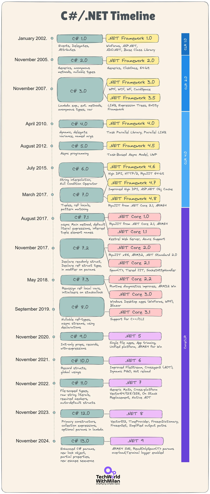

---
