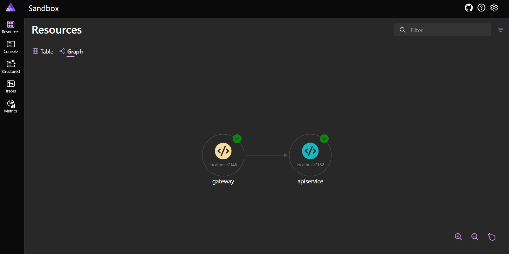
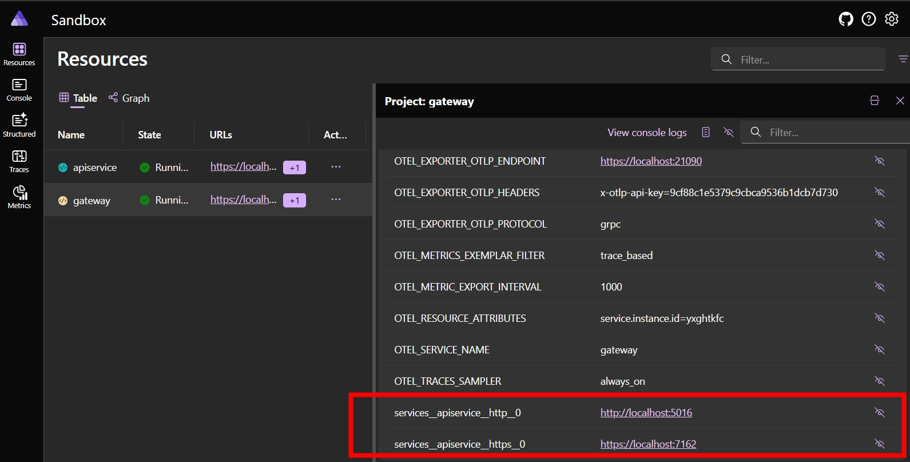
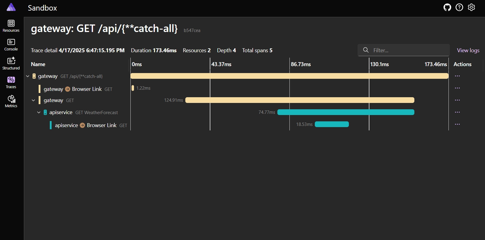

- **Citação**
  - **Título**: Using YARP as BFF within .NET Aspire: Integrating YARP into .NET Aspire
  - **Autor**: Tim Deschryver
  - **Fonte**: Blog Tim Deschryver
  - **URL**: https://timdeschryver.dev/blog/integrating-yarp-within-dotnet-aspire?utm_source=bonobopress&utm_medium=newsletter&utm_campaign=2048
  - **Atualizado**: 30 de abril de 2025

---

# Usando YARP como BFF no .NET Aspire: Integrando YARP no .NET Aspire

Mais projetos estão migrando para o padrão Backend for Frontend (BFF) para fornecer uma interação mais personalizada e eficiente entre um aplicativo frontend (por exemplo, um aplicativo Angular) e seus serviços de backend (por exemplo, uma WebAPI .NET ). Esse padrão tem alguns benefícios:

- Não há mais problemas irritantes com [CORS](https://developer.mozilla.org/en-US/docs/Web/HTTP/CORS) ao chamar APIs do frontend.
- Segurança aprimorada ao não armazenar segredos de usuários e aplicativos no código do frontend.
- Um processo de autenticação simplificado para o frontend, já que o BFF pode lidar com a autenticação e autorização em nome do aplicativo frontend.
- O desempenho dos aplicativos aumenta, pois o BFF pode agregar vários serviços de back-end em um único ponto de extremidade de API, reduzindo o número de chamadas de rede do front-end.

Para construir o BFF, podemos usar [YARP (Yet Another Reverse Proxy)](https://learn.microsoft.com/en-us/aspnet/core/fundamentals/servers/yarp/yarp-overview?WT.mc_id=DT-MVP-5004452), que é uma biblioteca de proxy reverso para ASP.NET Core. O YARP permite criar um servidor proxy reverso para rotear solicitações para diferentes serviços de back-end com base na URL da solicitação ou em outros critérios.

> Observação: O YARP também está disponível como um [contêiner Docker](https://hub.docker.com/r/microsoft/dotnet-nightly-yarp) (em visualização).

Neste artigo, exploraremos como criar e integrar o YARP no [.NET Aspire](https://learn.microsoft.com/en-us/dotnet/aspire/get-started/aspire-overview?WT.mc_id=DT-MVP-5004452). O projeto YARP atuará como um _melhor amigo seguro_ e desempenhará o papel de controlador de tráfego entre o front-end (isso será adicionado em uma postagem futura) e os serviços de back-end.

## [Pré-requisitos](#pré-requisitos) link

Presumo que já exista um projeto .NET Aspire em funcionamento, que contém um projeto WebAPI. Se precisar de ajuda para configurar um novo projeto .NET Aspire, consulte a documentação [Introdução ao .NET Aspire](https://learn.microsoft.com/en-us/dotnet/aspire/get-started/build-your-first-aspire-app?WT.mc_id=DT-MVP-5004452).

Você deve obter uma solução na qual um projeto WebAPI é adicionado ao Aspire AppHost. No exemplo abaixo, o projeto WebAPI é chamado de `apiservice`.

```c#
var builder = DistributedApplication.CreateBuilder(args);

builder.AddProject<Projects.Sandbox_ApiService>("apiservice");

builder.Build().Run();
```

## [Adicionar um novo projeto YARP](#add-a-new-yarp-project) link

O primeiro passo é criar um novo projeto YARP dentro da solução existente. Como não há um modelo para YARP, crie um novo projeto vazio de API Web ASP.NET Core, que chamei de `Gateway`.

Se você estiver usando o Visual Studio, certifique-se de que a caixa de seleção "Inscrever-se na orquestração do Aspire" esteja marcada (marcada por padrão) no assistente, para que o novo projeto seja adicionado à solução existente. Isso registrará automaticamente o novo projeto no AppHost do Aspire e ele estará disponível para orquestração. Você também pode fazer isso manualmente adicionando uma referência de projeto do projeto `AppHost` ao novo projeto `Gateway` e registrando o projeto no Aspire.

```c#
var builder = DistributedApplication.CreateBuilder(args);

builder.AddProject<Projects.Sandbox_ApiService>("apiservice");
builder.AddProject<Projects.Sandbox_Gateway>("gateway");

builder.Build().Run();
```

Para verificar se o projeto está registrado corretamente, execute o projeto AppHost e verifique o Painel do Aspire. Usando a visualização gráfica, você deverá ver os projetos `apiservice` e `gateway` conectados entre si. Para visualizar o painel, execute o projeto AppHost .



O projeto Gateway recém-criado deve estar vazio por enquanto, com exceção da adição dos [padrões de serviço] do Aspire (https://learn.microsoft.com/en-us/dotnet/aspire/fundamentals/service-defaults?WT.mc_id=DT-MVP-5004452). Isso será importante mais tarde, pois adiciona a funcionalidade de descoberta de serviço. Ele adiciona mais do que isso, como a configuração do OpenTelemetry, mas esse não é o foco deste artigo.

```c#
var builder = WebApplication.CreateBuilder(args);

builder.AddServiceDefaults();

var app = builder.Build();

app.Run();
```

## [Instalar pacotes YARP](#install-yarp-packages) link

Após a criação do projeto, adicione os pacotes NuGet [Yarp.ReverseProxy](https://www.nuget.org/packages/Yarp.ReverseProxy/) e [Microsoft.Extensions.ServiceDiscovery.Yarp](https://www.nuget.org/packages/Microsoft.Extensions.ServiceDiscovery.Yarp).

```bash
dotnet add package Yarp.ReverseProxy
dotnet add package Microsoft.Extensions.ServiceDiscovery.Yarp
```

Quando os pacotes estiverem instalados, atualize o arquivo `Program` para adicionar e usar o YARP:

```c#
var builder = WebApplication.CreateBuilder(args);

builder.AddServiceDefaults();
builder.Services.AddReverseProxy();

var app = builder.Build();

app.MapReverseProxy();

app.Run();
```

## [Referência da API para o Gateway](#referência-da-api-para-o-gateway) link

Com o YARP, queremos redirecionar as solicitações recebidas para a API `apiservice`, mas não queremos manter a URL de cada API no projeto YARP. Embora isso não pareça um grande problema por enquanto com apenas uma API, pode se tornar um verdadeiro fardo quando o número de APIs aumentar ou quando ela for lançada.

É aí que o Aspire pode nos ajudar. Ele é responsável por orquestrar os diferentes projetos da solução e pode gerenciar as dependências com eficiência.

Com o Aspire, podemos "vincular" projetos. No nosso caso, o gateway (YARP) precisa estar ciente do projeto WebAPI `apiservice` . Para isso, podemos usar o método `WithReference` para adicionar uma referência ao projeto `apiservice` a partir do projeto `gateway`.

```c#
var builder = DistributedApplication.CreateBuilder(args);

var api = builder.AddProject<Projects.Sandbox_ApiService>("apiservice");
var gateway = builder.AddProject<Projects.Sandbox_Gateway>("gateway")
    .WithReference(api)
    .WaitFor(api)
    .WithExternalHttpEndpoints();

builder.Build().Run();
```

Ainda não chegamos lá, mas, no fim das contas, queremos manter nossos recursos internos seguros e ocultos do mundo externo (quando o projeto for implantado). O único recurso que deve ser exposto ao mundo externo é o projeto `gateway`; todo o tráfego deve passar por ele. É por isso que o código acima marca o projeto `gateway` como um recurso externo com o método `WithExternalHttpEndpoints` .

Ao criar esta referência entre os projetos `gateway` e `apiservice`, o endereço `apiservice` é registrado como uma variável de ambiente no projeto `gateway`. Isso pode ser visto no Painel do Aspire:



## [Configurar YARP](#configure-yarp) link

O YARP é configurado fornecendo um conjunto de rotas e clusters no arquivo `appsettings.json`. Isso também pode ser feito via código, mas eu pessoalmente acho mais fácil usar a configuração JSON.

As rotas definem como as solicitações são correspondidas e roteadas para os serviços de backend apropriados, enquanto os clusters definem os próprios serviços de backend.

Na configuração abaixo, definimos uma rota que corresponde às solicitações para `/api/{**catch-all}` e as encaminha para um cluster denominado `apiservice`. O cluster contém um único destino, que é o endereço do serviço de backend.

Isso significa que qualquer solicitação para `/api` será encaminhada para o serviço de backend `apiservice`.

```json
{
  "Logging": {
    "LogLevel": {
      "Default": "Information",
      "Microsoft.AspNetCore": "Warning"
    }
  },
  "ReverseProxy": {
    "Routes": {
      "apiservice": {
        "ClusterId": "apiservice",
        "Match": {
          "Path": "/api/{**catch-all}"
        },
        "Transforms": [
          {
            "PathRemovePrefix": "/api"
          }
        ]
      }
    },
    "Clusters": {
      "apiservice": {
        "Destinations": {
          "apiservice": {
            "Address": "http://apiservice"
          }
        }
      }
    }
  }
}
```

Observe que o endereço do serviço de backend não está definido para uma URL específica. Em vez disso, está definido como `http://apiservice`, que é o nome que demos ao projeto WebAPI ao registrá-lo no Aspire AppHost.

Você também pode ver que a configuração do YARP inclui uma transformação que remove o prefixo `/api` do caminho da solicitação antes de encaminhá-la ao serviço de backend. Estou fazendo isso porque o projeto WebAPI não utiliza o prefixo `/api` em suas rotas. Gosto de adicionar um prefixo às rotas no projeto YARP para poder distingui-las facilmente e evitar conflitos com rotas duplicadas quando mais projetos forem adicionados.

Por fim, a configuração do YARP pode ser carregada do arquivo `appsettings.json` usando o método `LoadFromConfig` no arquivo `Program.cs`.

```c#
var builder = WebApplication.CreateBuilder(args);

builder.AddServiceDefaults();
builder.Services
    .AddReverseProxy()
    .LoadFromConfig(builder.Configuration.GetSection("ReverseProxy"));

var app = builder.Build();

app.MapReverseProxy();

app.Run();
```

Para testar isso, execute o projeto AppHost, navegue até a URL do gateway no seu navegador e adicione `https://{gateway:portnumber}/api/weatherforecast` à URL. Esperamos ver os dados da previsão do tempo retornados pelo `apiservice`, pois nossa solicitação está sendo roteada pelo projeto `gateway` para `https://{apiservice:portnumber}/weatherforecast`.

Mas este não é o caso. Se observarmos o erro, disponível nos logs do Aspire, podemos ver que o projeto YARP não consegue resolver o endereço `apiservice`. Recebemos o seguinte erro:

```bash
name_resolution_error
http://apiservice/weatherforecast
```

## [Descoberta de serviço](#service-discovery) link

Isso acontece porque o `apiservice` não foi descoberto corretamente e, portanto, não está usando o endereço correto. Para resolver isso, invoque o método `AddServiceDiscoveryDestinationResolver` (proveniente do pacote NuGet `Microsoft.Extensions.ServiceDiscovery.Yarp`) no arquivo `Program.cs` do projeto YARP.

```c#
var builder = WebApplication.CreateBuilder(args);

builder.AddServiceDefaults();
builder.Services
    .AddReverseProxy()
    .LoadFromConfig(builder.Configuration.GetSection("ReverseProxy"))
    .AddServiceDiscoveryDestinationResolver();

var app = builder.Build();

app.MapReverseProxy();

app.Run();
```

Com essa alteração, o projeto YARP consegue resolver o endereço `apiservice` corretamente, para a rota correta `https://{apiservice:portnumber}`. No meu caso, ele roteia `https://localhost:7146/api/weatherforecast` para `https://localhost:7162/weatherforecast`.

Você pode acompanhar esta solicitação no Painel do Aspire, observando a visualização de rastreamento. Resultando no seguinte:

- o iniciador da solicitação, que é uma navegação para o ponto final `/api/weatherforecast`;
- O YARP está processando a solicitação recebida;
- O YARP está encaminhando a solicitação para o `apiservice`;
- O `apiservice` retornando uma resposta bem-sucedida;



## [Conclusão](#conclusão) link

Neste artigo, exploramos como integrar o YARP a um projeto .NET Aspire. Utilizamos a descoberta de serviços do Aspire para resolver automaticamente o endereço do serviço de back-end sem precisar codificar URLs na configuração do YARP.

Nas próximas postagens do blog, exploraremos como adicionar autenticação ao projeto YARP para proteger os endpoints da API. Também adicionaremos um projeto de front-end Angular à solução e o configuraremos para usar o projeto YARP como um BFF.

Se você não puder esperar, confira meu [Sandbox](https://github.com/timdeschryver/sandbox) para ver o código completo.

Fique à vontade para atualizar esta postagem do blog no [GitHub](https://github.com/timdeschryver/timdeschryver.dev/tree/main/blog/integrating-yarp-within-dotnet-aspire/index.md), obrigado antecipadamente!

---
