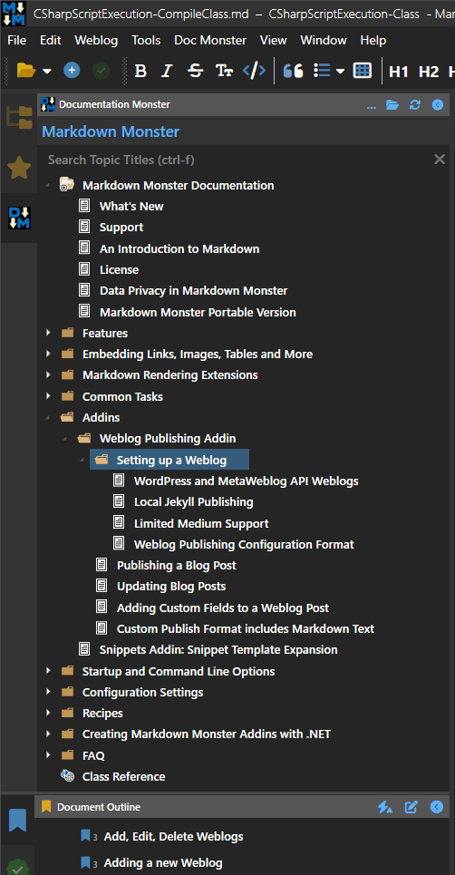

- **Citação**
  - **Título**: Avoiding WPF Image Control Local File Locking
  - **Autor**: Rick Strahl
  - **Fonte**: Rick Strahl's Weblog
  - **URL**: https://weblog.west-wind.com/posts/2025/Apr/28/WPF-Image-Control-Local-File-Locking?utm_source=bonobopress&utm_medium=newsletter&utm_campaign=2048
  - **Atualizado**: 28 de abril de 2025

---

# [Evitando o bloqueio de arquivos locais do controle de imagem WPF](https://weblog.west-wind.com/posts/2025/Apr/28/WPF-Image-Control-Local-File-Locking)

O bloqueio de imagens do WPF me atrapalhou bastante em aplicativos XAML: o controle de imagem do WPF, por padrão, bloqueia arquivos de imagem ao vincular diretamente a um arquivo de imagem no disco. Quando você simplesmente vincula ou atribui um arquivo de imagem, internamente o WPF usa um fluxo que não é fechado e mantido aberto. Em alguns casos, isso não importa, por exemplo, se suas imagens raramente ou nunca são atualizadas.

Mas em alguns casos isso importa: em vários dos meus aplicativos, tenho **vários ícones** que são carregados em um controle TreeView, sendo os ícones relacionados a modelos definidos pelo usuário que podem ser atualizados (e frequentemente são). Os arquivos bloqueados se tornam um problema, pois não podem ser excluídos. Em um caso de uso específico, atualizo meus modelos destruindo a pasta original, recriando-a e copiando os novos modelos que incluem as imagens de ícones potencialmente atualizadas. Com o comportamento de bloqueio padrão, isso falha, pois os arquivos bloqueados e o diretório pai não podem ser excluídos ou copiados.

Pode haver outros cenários também: em alguns casos, você pode usar um único arquivo de imagem que é atualizado pelo aplicativo e precisa ser exibido novamente após a alteração quando a imagem é recuperada.

Se você não conseguir atualizar a imagem, nada disso funciona. Existem maneiras de fazer isso funcionar, mas infelizmente o comportamento padrão é que o arquivo fique bloqueado. E, como costuma acontecer quando você começa a criar um novo controle ou formulário, você não pensa em problemas de bloqueio — isso só acaba te prejudicando mais tarde. E nesses casos, eu costumava passar um tempo me debatendo para lembrar exatamente quais configurações precisavam ser alteradas.

Esta postagem do blog tem como objetivo reunir tudo isso em um só lugar para que meu eu envelhecido possa encontrar e lembrar com mais facilidade 😄

## [Usando o controle de imagem com uma BitmapImage incorporada](#using-the-image-control-with-an-embedded-bitmapimage)

A primeira solução é integrada e funciona apenas com XAML. É um pouco prolixa, mas, fora isso, muito simples.

Em vez de vincular uma imagem como esta:

```xml
<Image Source={Binding TopicState.DisplayTypeIconFile} />
```

que se vincula diretamente a um arquivo no disco como uma string e bloqueia o arquivo de imagem, você pode vincular a uma fonte de Bitmap na qual pode controlar o comportamento do cache:

```xml
<Image Height="16">
    <Image.Source>
        <BitmapSource
            UriSource={Binding TopicState.DisplayTypeIconFile}
            CacheOption="OnLoad"
     />
    </Image.Source>
</Image>
```

Isso carrega a imagem na memória na vinculação e libera o fluxo de arquivo subjacente, o que resolve o problema de bloqueio.

Se você também precisar garantir que a imagem seja atualizada, você precisa adicionar:

```xml
<BitmapSource
    UriSource={Binding TopicState.DisplayTypeIconFile}
    CacheOption="OnLoad"
    CreateOptions="IgnoreImageCache"
 />
```

Isso força a imagem a recarregar sempre que for revinculada. Isso não é bom para o desempenho, então tome cuidado e use somente quando necessário, pois adiciona sobrecarga a cada operação de revinculação.

## [Mais genérico: usando um conversor de vinculação como intermediário](#more-generic-using-a-binding-converter-as-in-intermediary)

Outra maneira de fazer isso é por meio de um **Conversor de Vinculação** que lida com esse comportamento e permite liberar as imagens subjacentes em cache explicitamente para forçar o recarregamento das imagens quando a lista for recuperada.

A ideia aqui é que você possa usar um conversor em um caminho de imagem. A vantagem do conversor é que você tem mais controle sobre o processo de criação da imagem e pode fazê-lo consistentemente para muitas imagens usando a mesma lógica. Ele também pode armazenar imagens em cache para que imagens reutilizadas não sejam recarregadas.

Por exemplo, gosto de armazenar imagens em cache, pois no meu aplicativo reutilizo vários ícones para visualizações de árvores complexas:



**Figura 1** - Uma TreeView com muitas imagens repetidas que são armazenadas em cache e reutilizadas

Os ícones são armazenados em cache, de modo que cada ícone exclusivo é essencialmente carregado de uma única instância `BitmapImage`, o que economiza recursos e carrega visivelmente mais rápido.

Veja como fica o controle de imagem usando o conversor em um formulário XAML:

```xml
<UserControl.Resources>
    <windows:LocalFileImageConverter x:Key="LocalFileImageConverter"/>
<UserControl.Resources>

...

<Image Height="16"
       Source="{Binding TopicState.OpenImageFilename,
                Converter={StaticResource LocalFileImageConverter}}"
/>
```

### [Uma classe LocalFileImageConverter](#a-localfileimageconverter-class)

Este conversor recebe um link de arquivo local como uma string e o transforma em `BitmapImage`. Se uma imagem não puder ser encontrada, uma imagem padrão é retornada. Este conversor é usado especificamente para imagens de ícones no Markdown Monster e no Documentation Monster. As imagens são armazenadas em cache, de modo que qualquer referência a um ícone é reutilizada se for referenciada várias vezes, como é o caso na **Figura 1**.

```c#
public class LocalFileImageConverter : IValueConverter
{
    public  static Dictionary<string, BitmapImage> CachedBitmapImages = new Dictionary<string, BitmapImage>();

    public static void ClearCachedImages()
    {
        CachedBitmapImages = new Dictionary<string, BitmapImage>();
    }

    public object Convert(object value, Type targetType,
                          object parameter, System.Globalization.CultureInfo culture)
    {
        string val = value as string;

        if (!string.IsNullOrEmpty(val))
        {
            val = ((string)value).ToLower();

            if (CachedBitmapImages.TryGetValue(val, out BitmapImage bi))
                return bi;

            try
            {
                using (var fstream = new FileStream(value.ToString(), FileMode.Open, FileAccess.Read, FileShare.Read))
                {
                    bi = new BitmapImage();
                    bi.BeginInit();
                    bi.CacheOption = BitmapCacheOption.OnLoad;
                    bi.StreamSource = fstream;
                    bi.StreamSource.Flush();
                    bi.EndInit();
                    bi.Freeze();

                    bi.StreamSource.Dispose();
                }
                CachedBitmapImages.Add(val, bi);
                return bi;
            }
            catch {
            }

            return AssociatedIcons.DefaultIcon;
        }
        //if (val != null)
        //    CachedBitmapImages.Add(val, null);
        return null;
    }

    public object ConvertBack(object value, Type targetType, object parameter, System.Globalization.CultureInfo culture)
    {
        throw new NotImplementedException("LocalFileImageConverter: Two way conversion is not supported.");
    }
}
```

#### [Carregamento de imagem sem bloqueio](#non-locking-image-loading)

Há algumas coisas interessantes. A primeira é o carregamento da imagem, que é personalizado para carregamento sem cache, o que garante que a imagem não fique bloqueada no disco:

```c#
using (var fstream = new FileStream(value.ToString(), FileMode.Open, FileAccess.Read, FileShare.Read))
{
    bi = new BitmapImage();
    bi.BeginInit();
    bi.CacheOption = BitmapCacheOption.OnLoad;
    bi.StreamSource = fstream;
    bi.StreamSource.Flush();
    bi.EndInit();
    bi.Freeze();  // optional optimization
}
CachedBitmapImages.Add(val, bi);
return bi;
```

Observe que este código libera explicitamente o fluxo e congela a imagem. Descobri que, em algumas situações, a falta de liberação fazia com que o fluxo permanecesse aberto. A liberação força a leitura para o final. `Freeze()` otimiza o uso da imagem, pois remove quaisquer ganchos e verificações de vinculação. Suspeito que isso tenha pouco efeito, já que a BitmapImage não está vinculada diretamente, mas `Freeze` não faz mal.

#### [Limpando o cache para atualizar imagens](#clearing-the-cache-to-refresh-images)

Outro recurso útil é que o cache pode ser limpo para que a imagem possa ser atualizada explicitamente. Cada instância de `BitmapImage` é armazenada em um dicionário estático em cache, indexado pelo caminho. Assim, várias imagens que referenciam o mesmo caminho reutilizam a mesma instância de `BitmapImage`.

É possível limpar o cache de imagens para forçar o recarregamento de todas as imagens do disco, ou você pode acessar diretamente o dicionário e remover um caminho individual e `BitmapImage`. Na próxima vez que esta imagem for reassociada, ela será recarregada do disco. Se a imagem tiver sido alterada, a imagem atualizada deverá ser renderizada. Observe que você precisa acionar a atualização e, potencialmente, a reassociação nos controles que são vinculados usando o conversor.

## [Resumo](#summary)

Carregar imagens do disco geralmente é desaprovado no WPF. O WPF prefere carregar coisas de recursos compilados, mas se você tiver arquivos configuráveis pelo usuário, como ícones ou imagens personalizados, arquivos externos são necessários para que isso funcione. E nesses cenários, é especialmente importante que os arquivos não sejam bloqueados quando precisam ser atualizados, já que esses arquivos externos podem ser atualizados (e frequentemente o são) individualmente como parte da operação do aplicativo ou, como no meu caso, em uma operação de atualização de modelos em massa.

Os controles `<Image>` e `<BitmapImage>` têm algum suporte integrado para evitar travamentos, mas são bastante prolixos e, pelo menos para mim, difíceis de lembrar. Pessoalmente, prefiro um conversor que garanta universalmente que as imagens sejam carregadas e armazenadas em cache da mesma maneira.

Este conversor `LocalFileImageConverter` é uma ferramenta antiga, mas, atualmente, eu o uso para praticamente qualquer aplicativo que utilize um controle TreeView ou List com ícones. Mas também funciona para outros tipos de imagens carregadas do disco... desde que eu **lembre**. Espero que este post ajude. 😄

---
