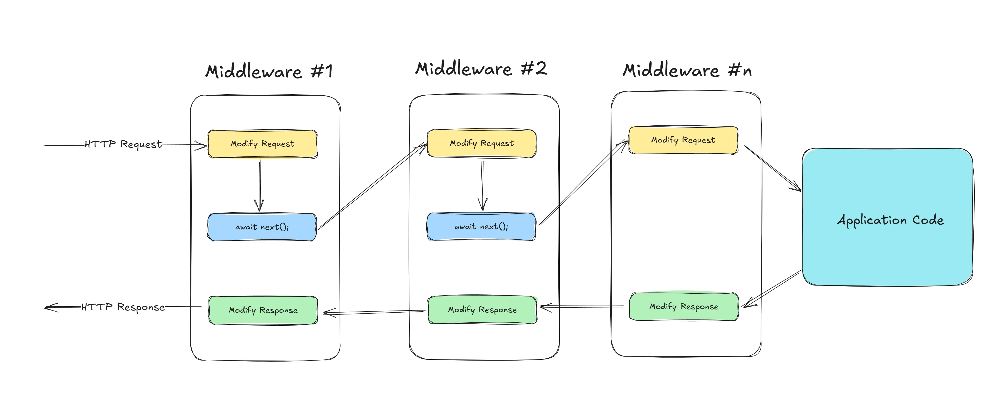

- **Citação**
    - **Título**: Understanding Middlewares in ASP.NET Core - Everything you Need to Know!
    - **Autor**: Mukesh Murugan
    - **Fonte**: Code With Mukesh
    - **URL**: https://codewithmukesh.com/blog/middlewares-in-aspnet-core/
    - **Atualizado**: 26 de março de 2025

---

# Understanding Middlewares in ASP.NET Core - Everything you Need to Know!

O ASP.NET Core segue um pipeline de processamento de solicitações poderoso e flexível que permite aos desenvolvedores controlar como as solicitações HTTP são tratadas. No centro desse pipeline está o middleware — uma série de componentes que processam solicitações e respostas.

Cada solicitação que chega a um aplicativo ASP.NET Core segue uma jornada bem definida pelo pipeline de solicitações antes de gerar uma resposta. Esse pipeline é construído usando middleware, um mecanismo poderoso que permite aos desenvolvedores inspecionar, modificar ou interromper solicitações e respostas.

Neste artigo, exploraremos como o ASP.NET Core processa solicitações de entrada, como o middleware funciona e como você pode criar seu próprio middleware para aprimorar os recursos da sua API Web.

> Este artigo faz parte do meu [curso .NET Web API Zero to Hero](/courses/dotnet-webapi-zero-to-hero/), onde abordo tudo o que você precisa saber para criar APIs eficientes e escaláveis. Entender middleware ajudará você a controlar como as solicitações são processadas, gerenciar registros, lidar com a segurança e melhorar o desempenho. Isso garante que sua API esteja estruturada corretamente, com tratamento de erros, autenticação e roteamento adequados.

Ao aprender middleware, você também poderá criar componentes personalizados para estender o ASP.NET Core e adicionar recursos específicos à sua aplicação. Dominar esse conceito facilitará o trabalho com tópicos mais avançados, como segurança, ajuste de desempenho e otimização de APIs. Se você deseja construir APIs Web melhores, esta é uma etapa essencial.

## O que são middlewares no ASP.NET Core?
-------------------------------------

O middleware no ASP.NET Core é um bloco de construção fundamental do pipeline de requisições. Ele atua como uma série de componentes de software que processam requisições e respostas HTTP. Cada componente de middleware pode inspecionar, modificar ou até mesmo encerrar uma requisição antes que ela atinja a lógica central da aplicação. Isso permite que os desenvolvedores lidem com tarefas como autenticação, registro em log, tratamento de erros e modificação de respostas de forma estruturada.

Quando uma solicitação entra na aplicação, ela flui pelo pipeline do middleware na ordem em que é registrada. Cada componente do middleware tem a opção de processar a solicitação, fazer alterações nela ou passá-la para o próximo middleware na fila. Se necessário, o middleware também pode gerar uma resposta imediatamente, efetivamente causando um curto-circuito no pipeline e impedindo a execução posterior de outros componentes do middleware.

O pipeline de middleware foi projetado para ser altamente flexível. Os desenvolvedores podem usar middleware integrado para tarefas comuns, como roteamento, autenticação, registro em log e tratamento de exceções, ou criar middleware personalizado, adaptado a necessidades específicas. Como os componentes do middleware são executados em sequência, sua ordem no pipeline é crítica. _Por exemplo, um middleware de autenticação deve ser executado antes da autorização, garantindo que a identidade do usuário seja estabelecida antes da verificação das permissões._

O ASP.NET Core facilita o registro de middleware no arquivo `Program.cs`, onde são adicionados ao pipeline usando métodos como `app.Use`, `app.Run` e `app.Map`. Essa abordagem estruturada garante que as solicitações sejam tratadas de forma consistente, ao mesmo tempo que oferece aos desenvolvedores a capacidade de personalizar e estender o pipeline conforme necessário.

## Como funcionam os middlewares?
---------------------

Cada middleware no pipeline segue um padrão simples: recebe o `HttpContext`, realiza algum processamento e, em seguida, chama o próximo middleware ou causa um curto-circuito no pipeline, gerando uma resposta imediatamente. Se o middleware causar um curto-circuito na solicitação, ele impede a execução de outros componentes do middleware, permitindo otimizações como tratamento de erros ou retorno antecipado de respostas armazenadas em cache.

Ao estruturar o middleware corretamente, os desenvolvedores podem gerenciar com eficiência o registro em log, a segurança, o tratamento de erros e a transformação de solicitações, garantindo um fluxo de trabalho de processamento de solicitações tranquilo e previsível em aplicativos ASP.NET Core.

Aqui está uma ilustração simples de como os middlewares funcionam em aplicativos ASP.NET Core.



* * *

## Ordem de execução do middleware
--------------------------

A ordem em que os componentes do middleware são adicionados ao pipeline de solicitação é crucial no ASP.NET Core. O middleware é executado sequencialmente na ordem em que é registrado, o que significa que cada middleware pode modificar a solicitação antes de passá-la para o próximo componente ou modificar a resposta no caminho de volta.

Quando uma solicitação entra no pipeline, ela flui por cada middleware **na ordem em que são registrados**. Se um middleware chamar `await next()`, a solicitação continua para o próximo middleware. No caminho de volta, a resposta passa pelo middleware em **ordem reversa**, permitindo modificações antes de chegar ao cliente.

### **Exemplo de ordem de execução de middleware**

```c#
app.Use(async (context, next) =>
{
    Console.WriteLine("Middleware 1: Incoming request");
    await next();  // Pass control to the next middleware
    Console.WriteLine("Middleware 1: Outgoing response");
});

app.Use(async (context, next) =>
{
    Console.WriteLine("Middleware 2: Incoming request");
    await next();
    Console.WriteLine("Middleware 2: Outgoing response");
});

app.Run(async (context) =>
{
    Console.WriteLine("Middleware 3: Handling request and terminating pipeline");
    await context.Response.WriteAsync("Hello, world!");
});
```

### **Fluxo de execução esperado**

```bash
Middleware 1: Incoming request
Middleware 2: Incoming request
Middleware 3: Handling request and terminating pipeline
Middleware 2: Outgoing response
Middleware 1: Outgoing response
```

1. O cliente faz uma requisição.
2. O Middleware 1 é acionado e exibe `"Middleware 1: Incoming request"`, depois passa o controle ao Middleware 2.
3. O Middleware 2 exibe `"Middleware 2: Incoming request"` e passa o controle ao Middleware 3.
4. O Middleware 3 processa a requisição e retorna `"Hello, world!"`.
5. O fluxo retorna para o Middleware 2, que exibe `"Middleware 2: Outgoing response"`.
6. O fluxo retorna para o Middleware 1, que exibe `"Middleware 1: Outgoing response"`.
7. A resposta final é enviada ao cliente.

* O middleware é executado na ordem em que é adicionado em `Program.cs`.
* `app.Use()` permite que a solicitação continue no pipeline e modifica as respostas no caminho de volta.
* `app.Run()` causa um curto-circuito no pipeline e impede a execução posterior do middleware.
* A ordem é importante — colocar o middleware de autenticação antes do middleware de autorização garante que os usuários sejam autenticados antes de verificar as permissões.

* * *

## Delegado de solicitação e HttpContext - Conceitos principais
----------------------------------------------

Quando uma solicitação chega a um aplicativo ASP.NET Core, ela passa por uma série de componentes de middleware antes de gerar uma resposta. No centro desse processo estão os **delegados de solicitação** e o **HttpContext**.

Um **delegado de solicitação** é uma função que manipula uma solicitação HTTP e determina como ela deve ser processada. Ele pode modificar a solicitação, gerar uma resposta ou passar o controle para o próximo middleware no pipeline. Isso permite um controle mais preciso sobre o processamento da solicitação.

Por outro lado, **HttpContext** fornece todos os detalhes sobre a solicitação e resposta HTTP atuais. Ele contém informações como cabeçalhos, parâmetros de consulta, detalhes de autenticação e configurações de resposta, permitindo que os desenvolvedores interajam e manipulem o ciclo de vida da solicitação de forma eficaz.

### **Request Delegate**

No ASP.NET Core, um **delegado de solicitação** é uma função que processa solicitações HTTP. É o bloco de construção central do middleware e define como cada solicitação é tratada no pipeline. Delegados de solicitação podem processar uma solicitação e passá-la para o próximo middleware ou gerar uma resposta diretamente.

Há três maneiras de definir delegados de solicitação:

1. **Middleware em linha (usando expressões Lambda)**

```c#
app.Use(async (context, next) =>
{
    Console.WriteLine("Incoming request: " + context.Request.Path);
    await next();
    Console.WriteLine("Outgoing response: " + context.Response.StatusCode);
});
```
    
Aqui, `next()` garante que o próximo middleware no pipeline seja executado.

2. **Usando `Run` para causar curto-circuito no pipeline**

```c#
app.Run(async context =>
{
    await context.Response.WriteAsync("Hello from the last middleware!");
});
```

`app.Run` não chama `next()`, o que significa que ele causa um curto-circuito no pipeline de solicitação.

3. **Usando classes de middleware**

```c#
public class CustomMiddleware
{
    private readonly RequestDelegate _next;

    public CustomMiddleware(RequestDelegate next)
    {
        _next = next;
    }

    public async Task InvokeAsync(HttpContext context)
    {
        Console.WriteLine("Custom Middleware Executing...");
        await _next(context);
        Console.WriteLine("Custom Middleware Finished.");
    }
}
```
    
Registre-o em `Program.cs`:

```c#
app.UseMiddleware<CustomMiddleware>();
```

* * *

### **HttpContext**

`HttpContext` representa a solicitação e a resposta HTTP atuais. Ele contém tudo relacionado à solicitação que está sendo processada.

#### **Propriedades comumente usadas de `HttpContext`**

1. **Acessando dados de solicitação**

```c#
string method = context.Request.Method;
string path = context.Request.Path;
string query = context.Request.QueryString.ToString();
```
    
2. **Leitura de cabeçalhos de solicitação**

```c#
string userAgent = context.Request.Headers["User-Agent"];
```
    
3. **Manipulando Parâmetros de Consulta**

```c#
string name = context.Request.Query["name"];
```
    
4. **Configurando dados de resposta**

```c#
context.Response.StatusCode = 200;
await context.Response.WriteAsync("Hello, World!");
```
    
5. **Verificando Autenticação e Autorização**

```c#
bool isAuthenticated = context.User.Identity.IsAuthenticated;
```

* * *

### **Como o Request Delegate e o HttpContext funcionam juntos**

Cada delegado de solicitação recebe um `HttpContext`, processa-o e:

* Chama o próximo middleware no pipeline (`await next();`)
* Retorna uma resposta imediatamente (`context.Response.WriteAsync("Hello!");`)

* * *

## Middlewares integrados
--------------------

O ASP.NET Core fornece diversos componentes de middleware integrados que gerenciam funcionalidades essenciais. Esses middlewares podem ser adicionados ao pipeline de requisição para habilitar diversos recursos, como autenticação, roteamento, tratamento de exceções e muito mais. Aqui estão alguns middlewares integrados comumente usados:

### **1. Middleware de Tratamento de Exceções**

Este middleware captura exceções não tratadas e fornece um mecanismo centralizado para lidar com erros. Ele garante que os erros sejam registrados corretamente e pode retornar respostas de erro personalizadas.

```c#
app.UseExceptionHandler("/Home/Error");
```

### **2. Middleware de roteamento**

O roteamento determina como as solicitações HTTP recebidas são mapeadas para os endpoints apropriados no aplicativo. O middleware de roteamento é crucial para definir rotas de API e ações MVC.

```c#
app.UseRouting();
```

### **3. Middleware de Autenticação e Autorização**

Esses middlewares controlam a autenticação do usuário e o controle de acesso, garantindo que somente usuários autorizados possam acessar determinados endpoints.

```c#
app.UseAuthentication();
app.UseAuthorization();
```

### **4. Middleware de arquivos estáticos**

Ele fornece conteúdo estático como HTML, CSS, JavaScript e imagens diretamente da pasta `wwwroot`.

```c#
app.UseStaticFiles();
```

### **5. Middleware CORS**

O middleware **Cross-Origin Resource Sharing** (CORS) controla como sua API lida com solicitações de diferentes domínios.

```c#
app.UseCors(options =>
    options.WithOrigins("https://example.com")
           .AllowAnyMethod()
           .AllowAnyHeader());
```

### **6. Middleware de compressão de resposta**

Melhora o desempenho compactando as respostas antes de enviá-las ao cliente, reduzindo o uso de largura de banda.

```c#
app.UseResponseCompression();
```

### **7. Middleware de Sessão**

Isso permite o gerenciamento de sessões armazenando dados de sessão do usuário na memória ou em armazenamentos distribuídos como o Redis.

```c#
app.UseSession();
```

### **8. Middleware de redirecionamento HTTPS**

Força todas as solicitações a usar HTTPS, garantindo uma comunicação segura.

```c#
app.UseHttpsRedirection();
```

### **9. Middleware de registro de solicitações**

Registra solicitações HTTP para fins de depuração, auditoria ou monitoramento.

```c#
app.UseSerilogRequestLogging();
```

### **10. Middleware de ponto de extremidade**

A etapa final no processamento de solicitações, este middleware corresponde às solicitações recebidas aos seus respectivos controladores, páginas Razor ou pontos de extremidade mínimos da API.

```c#
app.UseEndpoints(endpoints =>
{
    endpoints.MapControllers();
    endpoints.MapRazorPages();
});
```

* * *

## Middleware personalizado – escrevendo o seu próprio
------------------------------------

Embora o ASP.NET Core forneça vários componentes de middleware integrados, há momentos em que é necessário implementar um middleware personalizado para atender a requisitos específicos da aplicação. O middleware personalizado permite modificar solicitações e respostas, implementar logs, autenticação, cache ou qualquer outra funcionalidade necessária à sua aplicação.

### **Criando um Middleware Personalizado**

Um componente de middleware no ASP.NET Core deve:

1. Aceitar um `RequestDelegate` em seu construtor.
2. Implemente um método `Invoke` ou `InvokeAsync` que processe a solicitação.

#### **Etapa 1: Criar uma classe de middleware**

```c#
public class CustomMiddleware
{
    private readonly RequestDelegate _next;

    public CustomMiddleware(RequestDelegate next)
    {
        _next = next;
    }

    public async Task InvokeAsync(HttpContext context)
    {
        // Before the request is processed
        Console.WriteLine("Custom Middleware: Request Processing Started");

        await _next(context); // Call the next middleware

        // After the request is processed
        Console.WriteLine("Custom Middleware: Response Sent");
    }
}
```

#### **Etapa 2: Registrar Middleware no Pipeline**

Agora, você precisa adicionar esse middleware ao pipeline de solicitação do aplicativo em `Program.cs`.

```c#
app.UseMiddleware<CustomMiddleware>();
```

Como alternativa, você pode registrar o middleware usando um método de extensão:

```c#
public static class CustomMiddlewareExtensions
{
    public static IApplicationBuilder UseCustomMiddleware(this IApplicationBuilder builder)
    {
        return builder.UseMiddleware<CustomMiddleware>();
    }
}
```

Agora, em `Program.cs`, basta usar:

```c#
app.UseCustomMiddleware();
```

### **Exemplo: Middleware personalizado para solicitações de registro**

Aqui está um exemplo de um middleware que registra solicitações recebidas:

```c#
public class RequestLoggingMiddleware
{
    private readonly RequestDelegate _next;
    private readonly ILogger<RequestLoggingMiddleware> _logger;

    public RequestLoggingMiddleware(RequestDelegate next, ILogger<RequestLoggingMiddleware> logger)
    {
        _next = next;
        _logger = logger;
    }

    public async Task InvokeAsync(HttpContext context)
    {
        _logger.LogInformation($"Incoming Request: {context.Request.Method} {context.Request.Path}");

        await _next(context); // Continue the pipeline

        _logger.LogInformation($"Response Status Code: {context.Response.StatusCode}");
    }
}
```

Registre-o:

```c#
app.UseMiddleware<RequestLoggingMiddleware>();
```

## 2 maneiras comuns de criar middleware no ASP.NET Core
--------------------------------------------------

No ASP.NET Core, o middleware pode ser criado de diferentes maneiras, dependendo do nível de personalização necessário. As duas abordagens mais comuns são o **Middleware Baseado em Delegação de Solicitação** e o **Middleware Baseado em Convenção**.

### **Middleware baseado em `Request Delegate` (Delegado de solicitação)**

Esta é a maneira mais simples de criar middleware usando delegados de solicitação em linha. Ela permite definir a lógica do middleware diretamente no arquivo `Program.cs` sem criar uma classe separada.

```c#
app.Use(async (context, next) =>
{
    Console.WriteLine("Request Received: " + context.Request.Path);
    await next(); // Call the next middleware in the pipeline
    Console.WriteLine("Response Sent: " + context.Response.StatusCode);
});
```

Essa abordagem é útil para pequenas e rápidas modificações no pipeline de solicitações, como registrar ou modificar cabeçalhos de solicitação. No entanto, para lógicas mais complexas, recomenda-se o uso de middleware baseado em convenções.

* * *

### **Middleware baseado em convenção**

O middleware baseado em convenções segue uma abordagem estruturada, definindo uma classe de middleware. Isso melhora a reutilização, a manutenibilidade e a separação de responsabilidades.

```c#
public class CustomMiddleware
{
    private readonly RequestDelegate _next;

    public CustomMiddleware(RequestDelegate next)
    {
        _next = next;
    }

    public async Task InvokeAsync(HttpContext context)
    {
        Console.WriteLine("Custom Middleware Executing...");
        await _next(context);
        Console.WriteLine("Custom Middleware Finished.");
    }
}
```

Aqui estão as convenções necessárias,

* O construtor deve receber um parâmetro `RequestDelegate`, que representa o próximo middleware no pipeline.
* Isso permite que o middleware passe o controle para o próximo componente, se necessário.
* O método deve ser chamado Invoke ou InvokeAsync.
* Deve aceitar um parâmetro HttpContext.
* Deve retornar uma Tarefa para dar suporte ao processamento assíncrono.

O middleware baseado em convenção é a abordagem preferida ao criar componentes de middleware reutilizáveis que lidam com registro, segurança, modificações de solicitação ou transformações de resposta.

* * *

### Qual é a abordagem correta?

Utilize **middleware baseado em delegação de solicitações** para tarefas simples, como registro de solicitações ou configuração de cabeçalhos. Quando você precisa de mais flexibilidade, o **middleware baseado em convenções** é a melhor escolha para lógicas complexas que devem ser reutilizáveis em diferentes aplicativos.

## Curto-circuito no Pipeline
-----------------------------

Em alguns cenários, pode ser necessário interromper o prosseguimento da solicitação no pipeline do middleware. Isso é conhecido como **curto-circuito** no pipeline. Em vez de passar a solicitação para o próximo middleware usando `_next(context)`, você pode gerar uma resposta imediatamente. Essa técnica é útil para cenários como modo de manutenção, verificações de autenticação, limitação de taxa ou retorno antecipado de respostas armazenadas em cache para melhorar o desempenho.

```c#
public class MaintenanceMiddleware
{
    private readonly RequestDelegate _next;

    public MaintenanceMiddleware(RequestDelegate next)
    {
        _next = next;
    }

    public async Task InvokeAsync(HttpContext context)
    {
        context.Response.StatusCode = 503;
        await context.Response.WriteAsync("Service is under maintenance.");
    }
}
```

Registre este middleware antes que outros middlewares entrem em vigor:

```c#
app.UseMiddleware<MaintenanceMiddleware>();
```

## Melhores práticas para middleware em APIs da Web
-----------------------------------------

O middleware desempenha um papel crucial no processamento de solicitações e respostas em APIs Web do ASP.NET Core. Projetar e estruturar o middleware corretamente garante melhor desempenho, manutenibilidade e segurança. Aqui estão algumas práticas recomendadas a serem seguidas ao trabalhar com middleware em APIs Web.

### **1. Mantenha o Middleware Leve**

O middleware deve se concentrar em uma única responsabilidade e evitar a execução de cálculos pesados ou tarefas de longa duração. Se for necessária lógica complexa, considere transferi-la para serviços em segundo plano ou camadas de aplicação separadas.

### **2. Ordene o Middleware Corretamente**

O middleware é executado na ordem em que é registrado, por isso é importante posicioná-lo estrategicamente. Por exemplo:

* O middleware de **manipulação de exceções** deve ser registrado primeiro para capturar todas as exceções não tratadas.
* **A autenticação** deve vir antes da **autorização** para garantir que o usuário seja identificado antes das verificações de acesso.
* **O tratamento de arquivos estáticos** deve ser colocado antes dos middlewares de processamento de solicitações para melhorar o desempenho.

### **3. Use middleware integrado sempre que possível**

O ASP.NET Core fornece um rico conjunto de middleware integrado para tratamento de exceções, autenticação, CORS, compactação de resposta, etc. Em vez de escrever middleware personalizado do zero, prefira soluções integradas para garantir confiabilidade e manutenibilidade.

```c#
app.UseExceptionHandler("/error");
app.UseAuthentication();
app.UseAuthorization();
app.UseRouting();
app.UseEndpoints(endpoints => endpoints.MapControllers());
```

### **4. Evite bloquear chamadas em middleware**

O middleware deve ser assíncrono para evitar o bloqueio do pipeline de solicitações e a degradação do desempenho. Use `async` e `await` ao lidar com solicitações.

**Má prática (bloqueio de chamadas)**

```c#
public void Invoke(HttpContext context)
{
    var result = SomeLongRunningOperation().Result; // Blocks the thread
    context.Response.WriteAsync(result);
}
```

**Boas Práticas (Chamada Assíncrona)**

```c#
public async Task InvokeAsync(HttpContext context)
{
    var result = await SomeLongRunningOperation();
    await context.Response.WriteAsync(result);
}
```

### **5. Faça um curto-circuito no Pipeline quando necessário**

Se uma solicitação puder ser processada antecipadamente (como retornar uma resposta em cache ou processar o modo de manutenção), faça um curto-circuito no pipeline para melhorar a eficiência.

```c#
public async Task InvokeAsync(HttpContext context)
{
    if (context.Request.Path == "/maintenance")
    {
        context.Response.StatusCode = 503;
        await context.Response.WriteAsync("Service is under maintenance.");
        return; // Stop further middleware execution
    }

    await _next(context);
}
```

### **6. Use extensões de middleware para código limpo**

Para manter `Program.cs` limpo e modular, encapsule o registro do middleware dentro dos métodos de extensão.

```c#
public static class CustomMiddlewareExtensions
{
    public static IApplicationBuilder UseCustomMiddleware(this IApplicationBuilder builder)
    {
        return builder.UseMiddleware<CustomMiddleware>();
    }
}
```

Agora, registre-o simplesmente como:

```c#
app.UseCustomMiddleware();
```

### **7. Execução do Middleware de Log para Depuração**

Adicionar registro dentro do middleware ajuda a rastrear o processamento de solicitações e diagnosticar problemas.

```c#
public class LoggingMiddleware
{
    private readonly RequestDelegate _next;
    private readonly ILogger<LoggingMiddleware> _logger;

    public LoggingMiddleware(RequestDelegate next, ILogger<LoggingMiddleware> logger)
    {
        _next = next;
        _logger = logger;
    }

    public async Task InvokeAsync(HttpContext context)
    {
        _logger.LogInformation($"Request: {context.Request.Method} {context.Request.Path}");
        await _next(context);
        _logger.LogInformation($"Response: {context.Response.StatusCode}");
    }
}
```

### **8. Evite o uso excessivo de middleware**

Nem tudo precisa ser um middleware. Se a lógica for específica para determinados controladores ou ações, considere usar **filtros de ação** ou **camadas de serviço**. O middleware deve lidar com **questões transversais**, como registro em log, autenticação e tratamento de exceções.

* * *

## Ordem de execução de middleware recomendada (BÔNUS)
----------------------------------------------

Veja como você deve organizar seus middlewares em seus aplicativos .NET para maximizar o desempenho!

```c#
var app = builder.Build();

app.UseExceptionHandler("/error");       // 1. Global Exception Handling
app.UseHttpsRedirection();               // 2. Enforce HTTPS
app.UseRouting();                        // 3. Routing Middleware
app.UseCors();                           // 4. Enable CORS (if needed)
app.UseAuthentication();                 // 5. Authenticate Users
app.UseAuthorization();                  // 6. Check Permissions
app.UseMiddleware<CustomMiddleware>();   // 7. Custom Middleware (e.g., Logging)
app.UseEndpoints(endpoints =>            // 8. Endpoint Execution
{
    endpoints.MapControllers();
});

app.Run();
```

### Por que esta ordem?

1. [Tratamento de exceções](/blog/global-exception-handling-in-aspnet-core/) Primeiro: garante que todas as exceções não tratadas sejam capturadas antes de chegar ao cliente.
2. Redirecionamento HTTPS antecipado: redireciona HTTP para HTTPS o mais rápido possível.
3. Roteamento antes da autenticação: garante que as solicitações sejam mapeadas antes das verificações de autenticação.
4. Autenticação antes da autorização: um usuário deve ser autenticado antes de verificar as permissões.
5. Middleware personalizado antes dos endpoints: o registro, a limitação de taxa ou a modificação de solicitações devem ocorrer antes de atingir os controladores.

## **Resumo**
-----------

O middleware é uma parte fundamental do pipeline de requisições do ASP.NET Core, permitindo que os desenvolvedores **lidem com questões transversais**, como autenticação, registro em log, tratamento de erros e transformações de requisições. Entender como o middleware funciona, a ordem correta de execução e as melhores práticas garante que suas APIs Web sejam eficientes, seguras e fáceis de manter.

Neste artigo, abordamos:

* **O que é Middleware** e como ele processa solicitações.
* **Middlewares integrados** no ASP.NET Core e suas funções.
* **Request Delegates e HttpContext**, que são os blocos de construção do middleware.
* **Middleware personalizado** e como escrever o seu próprio para requisitos específicos.
* **Curto-circuito no pipeline** para otimizar o desempenho quando necessário.
* **Ordem de execução de middleware** e as melhores práticas recomendadas para estruturar seu pipeline.

Dominar middleware é crucial para qualquer desenvolvedor ASP.NET Core. Seja para lidar com autenticação, registro de erros ou otimizações de desempenho, o middleware oferece uma maneira limpa e modular de gerenciar solicitações e respostas.

Este artigo faz parte do meu curso gratuito **.NET Web API Zero to Hero**, onde abordo conceitos essenciais para a construção de APIs Web de alta qualidade. Se você achou isso útil, não deixe de **seguir meu curso** para obter conteúdo mais aprofundado. Além disso, sinta-se à vontade para **compartilhar com seus colegas** que possam se beneficiar! 🚀

Confira o curso completo aqui: [.NET Web API Zero to Hero](https://codewithmukesh.com/courses/dotnet-webapi-zero-to-hero/)
